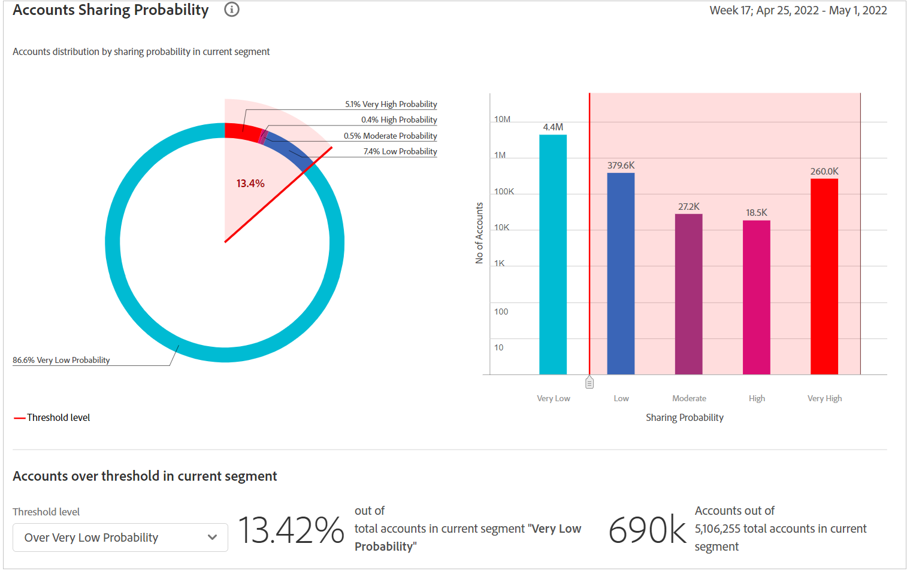

# Kontrollpanelen {#dashboard}

Kontrollpanelen sammanfattar och sammanställer data i en samling diagram och rapporter som utformats för att ge en översikt över omfattningen och effekten av kontodelning. Den innehåller en enda sida med de viktigaste rapporterna och mätvärdena från konto-IQ.

## Aggregerad delningspoäng {#aggregated-sharing}

Panelen Aggregated Sharing Score (Aggregated Sharing Score) innehåller en översta avläsning som sammanfattar hur stor del av materialet som delas i konton och strömningsvolymer.

Värdena hjälper er att förstå omfattningen av dina prenumeranters delning av autentiseringsuppgifter, vilket ger ett mått på behovet av att agera på den.

Följande tre mätvärden är komponenter i Aggregate Sharing Score.

### Delningsnivå {#sharing-level}

Med delningsnivåmätaren visas procentandelen av alla dina prenumerantkonton (i det definierade segmentet) som delas under den valda tidsramen.

Ett värde som beräknas baserat på ett genomsnitt av den sannolikhet för delning som beräknats för varje konto i den uppsättning av valda MVPD-program som har direktuppspelats från en av de valda programmeringskanalerna under den valda tidsramen.

Trend-indikatorn visar den procentuella förändringen av måttets värde i från föregående tidsram.

### Användning från delade konton {#usage-from-shared-accounts}

Den här mätaren anger hur stor procentandel av användningen av alla prenumerantkonton som kommer från de delade kontona för det definierade segmentet och tidsperioden. Mätaren anger användningsområdena (från delade konton) på skalan 0 till 100 %. Intervallen - Låg, Medel, Hög och Onormal - baseras på genomsnittet i branschen.

Du kan också se Trend-indikatorn, som visar en ökning eller minskning av användningen från delade konton jämfört med föregående tidsram.

### Total delning {#overall-sharing-score}

Det övergripande poängdelningspoängen består av delningspoäng som &quot;Delningsnivå&quot; och &quot;z Användning från delade konton&quot;.

Det ger ett värde som återspeglar den relativa effekten av delning jämfört med branschen. Syftet liknar syftet med en kreditpoäng som sammanfattar situationen med ett enda tal. Men i det här fallet är ju högre desto större blir den potentiella skadan.

<!--### MVPDs in segment {#mvpd-in-segment}

It is a table of risk indices and accounts totals for the top MVPDs ranked by overall usage or account sharing.

-->

### Branschövergripande poäng för utbyte av videofiler {#top-mvpds}

I den här tabellen visas en jämförande vy över de olika aggregerade delningspoängen för de programmerade videofilerna i segmentet.

>[!NOTE]
>
>I tabellen används övergripande branschdata för jämförande syften, inte de data som representeras av dessa videoprogrammeringsskyltar i segmentet.

### Dela poäng via kanaler och videoprogrammeringsfönster {#sharin-score-by-channels-and-mvpds}

I den här tabellen visas en jämförande vy över delningspoängen för de valda kanalerna för de olika programmeringsversionerna i det aktuella segmentet.

### Sannolikhet för kontodelning {#accounts-sharing-probability}

Diagrammet delas upp i intervall med sannolika quinles för delning från mycket låg (0-20 %) till mycket hög (80=100 %).

>[!NOTE]
>
>I stapeldiagrammet används en logaritmisk skala.

### Antal konton och användning genom att dela sannolikhetsnivå {#number-of-accounts-usage-sharing-probability}

Den här panelen ger en tabellvy över konton som är uppdelade i intervall där sannolikhetsfrågor för delning delas, från mycket låga (0-20 %) till mycket höga (80=100 %) med varje quintiles associerade användning från delade konton.

