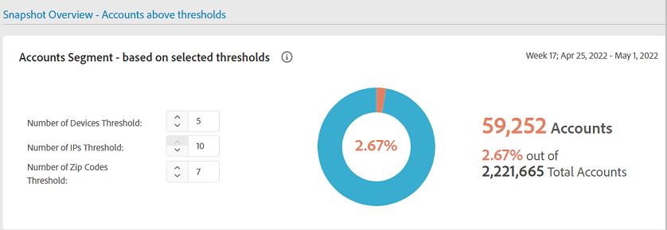

# Allmänna användningsrapporter {#general-usage-reports}

IQ-rapporter för konton är grundläggande analysverktyg och rapporter som gör att du kan gå in i data för att isolera dem [kohorter](/help/AccountIQ/product-concepts.md#segmet-def), identifiera avvikelser och bygga upp en förståelse för dina kontoegenskaper.

Rapporteringssidan General Usage innehåller verktyg för att ta bort undergruppsmått baserat på antalet kontoenheter som används, IP-adresser som har identifierats och respektive postnummer.

<!--Divide the content in cohorts.

Content filters
device filters

segment and definition replicate to cohorts. Number of people and number of account that ......
content consumption.....-->

Alla rapporter baseras på det aktuella segment som valts med [Segment och tidsram](/help/AccountIQ/howto-select-segment-timeframe.md) -panelen. Du kan finjustera markeringen och begränsa den ytterligare genom att ange tröskelvärden (antal enheter, antal IP-adresser och antal postkoder) i [Översikt över ögonblicksbild - konton över tröskelvärden](#snapshot-overview) -panelen.

<!--To view General Usage Reports:

1. Select the desired MVPDs from the **MVPDs in Segment** option.

2. Select the desired programmer channels from the **Channels in Segment** Option.

3. Select an appropriate time frame from the **Granularity and time frame** option.

   Using the above options you have defined segments for your analysis. Based on your segment selection, following graphs and reports are displayed.

4. You can fine tune your selection and further narrow it down by specifying (number of devices, number of IPs, and number of zip codes) thresholds in [Snapshot Overview - Accounts above thresholds](#snapshot-overview) widget/panel.-->

## AuthN OK/AuthZ OK/Uppspelningsbegäranden/unika prenumeranter {#authn-authz-playreq-uniquesubs}

I linjediagrammen här visas hur värdena för AuthN OK, AuthZ OK, Play-begäranden och Unika prenumeranter ändras över tiden i en vald tidsram för det definierade segmentet.

+++Programmer- **AuthN OK/AuthZ OK/Uppspelningsbegäranden/unika prenumeranter**

*Bild: AuthN OK/AuthZ OK/Play-begäranden/unika prenumeranter för programmeraren*

+++

+++MVPD- **AuthN OK / AuthZ OK / Unika prenumeranter**

*Bild: AuthN OK/AuthZ OK/Unika prenumeranter för MVPD-användare*

+++

X-axeln visar enheterna inom den aktuella tidsramen och y-axeln representerar grundläggande aktivitetsmått för prenumeranten under den perioden. Med linjediagrammen kan du jämföra följande värden för de som prenumererar på videofilmsprogram och kanaler som du har valt på segmentmarkeringspanelen:

* **AuthN OK**

   AuthN OK är antalet lyckade autentiseringar. Mer information och definitioner finns i [Produktbegrepp: AuthN OK](/help/AccountIQ/product-concepts.md#authn-ok-def).

* **AuthZ OK**

   AuthZ OK är antalet lyckade auktoriseringar. Mer information och definitioner finns i [Produktbegrepp: AuthZ OK](/help/AccountIQ/product-concepts.md#authz-ok-def).

* **Spela upp begäranden**

   Uppspelningsbegäranden är antalet uppspelningsbegäranden. Mer information och definitioner finns i [Produktbegrepp: Spela upp begäranden](/help/AccountIQ/product-concepts.md#play-requests-def)

   >[!NOTE]
   >
   >Linjediagrammet för uppspelningsförfrågningar är inte tillgängligt för MVPD-användare.

* **Unika prenumeranter**

   Unika prenumeranter är antalet godkända unika prenumeranter. Mer information och definitioner finns i [Produktbegrepp: Unika prenumeranter](/help/AccountIQ/product-concepts.md#unique-subscriber-def)

   >[!NOTE]
   >
   >Det totala antalet unika prenumeranter omfattar även antalet unika enheter om en programmerare använder Adobe TempPass (som är en kostnadsfri förhandsversion) som en del av segmentet.

## Översikt över ögonblicksbild - konton över tröskelvärden {#snapshot-overview}

Finjustera analyser och rapporter med hjälp av det här extra filtret för att ange olika användningströsklar. När du har definierat segmentet (eller kohorten) för analys genom att välja önskat(a) MVPD(s) och önskade kanaler, kan du även använda följande filter för att analysera prenumeranternas beteende:

* Tröskelvärde för antal enheter

* Antal IP-tröskelvärden

* Antal postkoder, tröskel

När du uppdaterar tröskelvärden i [Kontosegment - baserat på valda tröskelvärden](#account-segments-basedon-segments) kan du visa effekten i:

* [Enheter per vecka (eller månad) per konto](#devices-week-account)

* [Platser per vecka (eller månad) per konto](#locations-week-account)

* [IP-adresser per vecka (eller månad) per konto](#ip-week-account)

* [Historisk vy över kontosegment](#account-segment-historical-view)

>[!NOTE]
>
>Standardvärdet för var och en av tröskelvärdena är 4. På sidan General Usage (Allmän användning) visas en analys för distributörer av videoprogrammeringstjänster med abonnenter som använder fyra (och fler än fyra) enheter, som förbrukar innehåll från fyra (och fler) olika geografiska platser och fyra (och fler) olika postnummer.

### Kontosegment - baserat på valda tröskelvärden {#account-segments-basedon-segments}

The **Kontosegment - baserat på valda tröskelvärden** I finns alternativ för att ange tröskelvärden (mellan 1 och 10) för antal enheter, antal IP-adresser och antal postkoder.

I diagrammet visas följande:

* absolut antal abonnentkonton, och

* Procentandel av det totala abonnentkontot i det segmentet.

   som använder X-antal enheter, Y-nummer för IP-adresser och Z-nummer för Zip-koder för att förbruka innehåll från din kanal för (definierat segment av) MVPD-program under en tidsram.

## Enheter per vecka (eller månad) per konto {#devices-week-account}

The **stolpdiagram** ger insikter om hur abonnenterna använder sina enheter för att komma åt innehåll.

X-axeln visar Antal konton och y-axeln visar Antal enheter. Baserat på det tröskelvärde som du anger för antal enheter per konto markeras det absoluta antalet prenumerantkonton som förbrukar innehåll från ett visst antal enheter under en veckas tid.

När du hovrar över ett streck (specifikt för antalet enheter) visas en etikett som ger information om antalet prenumerantkonton (och procentandelen av det totala antalet prenumerantkonton i segmentet) som direktuppspelar kanalinnehåll med dessa många enheter under en vecka.

I diagrammet markeras även följande:

* En röd linje som markerar tröskelvärdet som du anger.

* En grön linje som anger medelvärdet för antalet olika enheter som används av ett prenumerantkonto per vecka (eller månad).

Du kan jämföra tröskelnivån med det genomsnittliga antalet olika enheter som används av ett konto per vecka för att bedöma delningsnivån.

Diagrammet ger också en glimt av procentandelen prenumerantkonton som använder fler enheter än det angivna tröskelvärdet.

Med donationsdiagrammet kan du snabbt bedöma storleken på prenumerantkonton som förbrukar kanalinnehåll med enheter som överskrider det angivna tröskelvärdet (inom en tidsram).

## Platser per vecka (eller månad) per konto {#locations-week-account}

Gilla [Enheter per vecka (eller månad) per konto](#devices-week-account)kan du använda måtten Platser per vecka (eller månad) per konto för att analysera hur abonnentkontot används från olika platser, för att mer noggrant identifiera lösenordsdelning. X-axeln visar Antal konton och y-axeln visar Antal platser.

Resultat från det här måttet kombinerat med antal [Enheter per vecka (eller månad) per konto](#devices-week-account) och antal [IP-adresser per vecka (eller månad) per konto](#ip-week-account) hjälpa dig att bedöma instanserna av lösenordsdelning mer korrekt, så att autentiska användare inte räknas in.

När du har definierat ett segment och angett tröskelvärdet för antal platser, kan du identifiera från diagrammet:

* Antal (och procentandel) prenumeranter som konsumerar innehåll från (ett visst) x antal platser under en vecka.

* Procentandel av det totala antalet prenumerantkonton som visar innehåll från fler platser än tröskelvärdet.

* Jämför veckomedelvärdet (antal olika platser för ett konto) med tröskelvärdet.

## IP-adresser per vecka (eller månad) per konto {#ip-week-account}

Liknar [Enheter per vecka (eller månad) per konto](#devices-week-account) och [Platser per vecka (eller månad) per konto](#locations-week-account), **Antal IP-adresser per vecka per konto** Med mätvärden kan du analysera lösenordsdelning mer exakt och med större noggrannhet.

X-axeln visar Antal konton och y-axeln visar Antal IP.

När du har definierat ett segment (genom att markera MVPD-program och kanaler) och angett ett tröskelvärde för antalet IP-adresser, kan du identifiera det i diagrammet:

* Antal (och procentandel) prenumeranter som konsumerar innehåll från (ett specifikt) x antal IP-adresser per vecka.

* Procentandel av det totala antalet prenumerantkonton som visar innehåll från fler IP-adresser än tröskelvärdet.

* Jämför veckomedelvärdet (antal olika IP-adresser för ett konto) med tröskelvärdet.

## Kontosegment - historikvy {#account-segment-historical-view}

I diagrammet med historikvyn kan du jämföra användningsstatistik för olika tidsramar. Dessutom ritas de olika användningsmåtten tillsammans, som [Enheter per vecka (eller månad) per konto](#devices-week-account), [Platser per vecka (eller månad) per konto](#locations-week-account)och [IP-adresser per vecka (eller månad) per konto](#ip-week-account).

* X-axeln ritar upp tidsramen och y-axeln visar antalet prenumerantkonton, enheter, platser och IP-adresser.

* De orangefärgade strecken betecknar segment i olika tidsramar.

* Linjediagrammet ritar upp ändringarna i [Enheter per vecka (eller månad) per konto](#devices-week-account), [Platser per vecka (eller månad) per konto](#locations-week-account)och [IP-adresser per vecka (eller månad) per konto](#ip-week-account) värden över tidsbildrutan baserat på tröskelvärdet.

* De blå staplarna anger det totala antalet aktiva prenumeranter i branschen under en tidsram.

* Du kan markera specifika teckenförklaringar och de hjälper dig att skala diagrammet.

>[!MORELIKETHIS]
>
>* Lär dig hur du exporterar rapporter för de 1000 mest populära prenumeranterna i det valda segmentet med hjälp av filter i den allmänna användningsrapporten med hjälp av [Exportera de 1 000 populäraste kontona](/help/AccountIQ/export-acc-information.md) alternativ.

