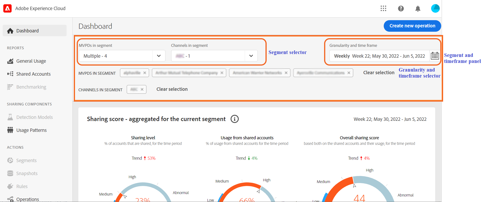

# Definiera ett segment och en tidsram {#define-segment}

Alla analys- eller visningsrapporter i konto-IQ börjar med att definiera segment och välja tidsram för utvärdering. [Segment](/help/AccountIQ/product-concepts.md#segmet-def) avser alla prenumeranter eller tittare som uppfyller dina kriterier (som prenumererar på ett separat dokumentationsdokument och visar specifika kanaler) för utvärderingen.

*Bild: Markering av segment och tidsramar*

Högst upp på alla rapportsidor i konto-IQ finns det en panel som definierar segment genom att välja programmerare för videoprogrammering, kornighet och tidsram.

## Segmentmarkering {#select-segment}

### Välj flerkanalsdokumentskydd i segment {#select-segment-mvpds}

Välj MVPD från **MVPD i segment** alternativ:

1. Klicka eller tryck på **MVPD i segment** rullgardinsalternativ.

   >[!NOTE]
   >
   >**Alla** branschens videofilmsprogram väljs som standard. Här kan du välja något av **Top 10 MVPDs by sharing score**, **De 10 viktigaste videobandspelare per användning**, **De 10 viktigaste versionerna per konto** eller enskilda videofilmsprogram. Om du vill markera enskilda PDF-filer måste du avmarkera **Alla**.

1. Klicka på eller tryck på de MVPD-filer du vill använda.

   Du kan ta bort ett PDF-dokument från markeringen genom att avmarkera det.

1. Klicka eller tryck **Använd markering** så att markeringen börjar gälla. Annars kommer du att förlora det du har gjort.

   >[!NOTE]
   >
   >Om du väljer Isoleringsläge går det inte att välja någon av de andra PDF-filerna.

### Markera kanaler i segment {#select-segment-channels}

Välj önskade programmeringskanaler på menyn **Kanaler i segment** alternativ:

1. Klicka eller tryck på **Kanaler i segment** rullgardinsalternativ.

   >[!NOTE]
   >
   >**Alla** programkanaler för ditt företag väljs som standard. Om du vill markera enskilda kanaler eller programmerare måste du först avmarkera **Alla**.

1. Klicka eller tryck på de kanaler eller programmerare du vill använda.

   Listobjekt på den översta nivån i **Kanaler i segment** är [programmerare](/help/AccountIQ/product-concepts.md#programmer-def) företag och listobjekten under programmerarnamn är deras [kanaler](/help/AccountIQ/product-concepts.md#channel-def). Du kan antingen välja enskilda kanaler under programmerare eller välja programmerare och alla aktiviteter för kanalerna under den programmeraren inkluderas i rapport- och diagramresultaten.

   

   *Bild: Programmerare och kanaler listade i kanalväljaren*

   >[!IMPORTANT]
   >
   >Resultatet av att välja enskilda kanaler under en programmerare är inte detsamma som att välja programmerare.
   >
   >
   >När du väljer enskilda kanaler delas aktiviteterna i dessa kanaler upp individuellt i vissa rapporter. När du väljer överordnad programmerare för alla dessa kanaler inkluderas alla dessa kanalers aktivitet, men de delas inte upp individuellt i rapporter.

1. Klicka eller tryck **Använd markering** så att markeringen börjar gälla.

>[!NOTE]
>
>Du kan inte markera mer än 10 objekt i menyerna MVPD eller Programmer pulldown.

### Avmarkera videofilmsprogram och kanaler {#deselect-segment-mvpds-channels}

Förutom att ändra markeringen i dialogrutan **MVPD i segment** och **Kanaler i segment** segmentväljare kan du avmarkera de tidigare markerade videofilmsprogrammen och kanalerna genom att:

* Markera **Ta bort** ikon () på namnen på de markerade videofilmarna och kanalerna som visas under segmentväljaren.

* Du kan också använda **Radera markering** om du vill ta bort alla tidigare markerade programmeringsskyltar eller kanaler.

*Bild: Valda videofilmsprogram och kanaler i segment- och tidsbildrutepanelen*

*Bild: Valda videofilmsprogram och kanaler i segment- och tidsbildrutepanelen*

## Kornighet och val av tidsram {#granularity-timeframe}

Så här väljer du en utvärderingsperiod:

1. Välj **Kornighet och tidsram** datumväljare.

1. Välj antingen **Vecka** eller **Månad** från **Sammanställd av** för att ange granularitet för utvärderingen.

   

   *Bild: Datumväljaren för att välja Kornighet och tidsram*

1. När du har valt granularitet kan du använda framåt- eller bakåtpilarna för att flytta framåt eller bakåt i tiden.

1. Ange en tidsperiod i bakgrunden (i månad eller vecka baserat på vald granularitet) för utvärdering.

1. Välj **Använd markering** för att säkerställa att markeringen genomförs.
