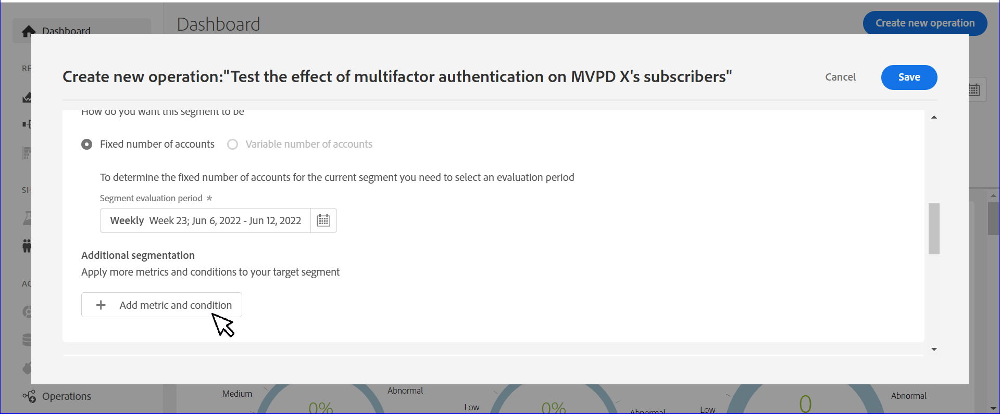
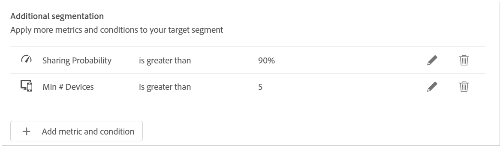

# Skapa en åtgärd för ett användarsegment {#operation-to-track-segment}

Varje rapportsida på konto-IQ har en **Skapa ny åtgärd** för att hjälpa dig att skapa arbetsflöden för att automatisera (och förenkla) olika (massåtgärder) åtgärder på prenumerantkonton, definiera regler för att ange ett exempel, definiera åtgärder samt registrera och analysera effekterna av dessa åtgärder. På sidan för att skapa åtgärder kan du definiera ett urval av användargrupper som åtgärderna ska utföras på och schemalägga åtgärden för ett framtida datum.

Så här skapar du en åtgärd:

1. Definiera ditt segment (kohort) för analys på någon av sidorna för rapporter eller kontrollpaneler enligt stegen i [Definiera segment och tidsram](/help/AccountIQ/howto-select-segment-timeframe.md).

1. Välj **Skapa ny åtgärd** som är tillgängliga på någon av rapportsidorna eller kontrollpanelssidorna. The **Skapa ny åtgärd** visas.

   
   *Bild: Sida för att skapa ny åtgärd*

1. På **Skapa ny åtgärd** sidan, fyll i informationen i formulärfälten för:

   * [Åtgärdsnamn](#operation-details) i operationsinformation
   * Segment som åtgärden ska köras på under [Målsegment](#segment) och förfina segmentet med [Ytterligare segmentering](#additional-segmentation)
   * [Segmenttyp](#segment-type) under [Målsegment](#segment)
   * [Åtgärd](#action)
   * [Schemalägg aktivering](#schedule)

1. [Spara åtgärden](#save-operation).

## Operationsinformation {#operation-details}

+++Programmer- åtgärdsinformation

Namnge den nya åtgärden i **Åtgärdsnamn** fält under Åtgärdsinformation. Till exempel &quot;*Testa effekten av multifaktorautentisering på MVPD X-prenumeranter eller Begränsa antalet strömmar i Concurrency Monitoring eller Begränsa MVPD D-prenumeranternas visningskanal N från 20 plus-enheter*&quot;.

+++

+++MVPD- åtgärdsinformation

Namnge den nya åtgärden i **Åtgärdsnamn** fält under Åtgärdsinformation. Till exempel &quot;*Testa effekten av multifaktorautentisering på kanalens N-tittare eller Begränsa antalet strömmar i Concurrency Monitoring eller Begränsa prenumerantens tittarkanal N från 20 plus-enheter*&quot;.

+++

## Målsegment {#segment}

+++Programmer- Målsegment

The **Segment** Här definieras vilka användare som ska användas av den här åtgärden, eller exempelgruppen för åtgärden. Standardsegmentet är **segment** du valde med [segment och tidsram](/help/AccountIQ/howto-select-segment-timeframe.md) på huvudrapporter eller kontrollpaneler i steg 1 ovan.

<!--* The first segment entry in the **Segment** section, by default, shows the **segment** you selected in the step 1.

* The **segment evaluation period** is the time period of analysis you selected in step 1 from **Granularity and Timeframe** option.

*Figure: Segment and timeframe selection on the main page*-->

Det här segmentet definierar de prenumeranter som påverkas av den åtgärd som skapas. Det valda segmentet kan till exempel ange *alla abonnentkonton för MVPD med namnet &#39;C&#39; som visar kanalen &#39;N Sports&#39;*.

+++

+++MVPD- Målsegment

The **Segment** Här definieras vilka användare som ska användas av den här åtgärden, eller exempelgruppen för åtgärden. Standardsegmentet är **segment** du valde med [segment och tidsram](/help/AccountIQ/howto-select-segment-timeframe.md) på huvudrapporter eller kontrollpaneler i steg 1 ovan.

<!--* The first segment entry in the **Segment** section, by default, shows the **segment** you selected in the step 1.

* The **segment evaluation period** is the time period of analysis you selected in step 1 from **Granularity and Timeframe** option.

*Figure: Segment and timeframe selection on the main page*-->

Det här segmentet definierar dina prenumeranter (som är tittare av specifika kanaler) som påverkas av den åtgärd som skapas. Ditt (standard) segment innehåller till exempel *alla abonnentkonton som visar kanalen &#39;N Sports&#39;*.
+++

### Ytterligare segmentering {#additional-segmentation}

Dessutom kan du förfina målsegmentet genom att lägga till fler mätvärden. Du kan till exempel lägga till en delningssannolikhet som är större än 90 % som ett annat mått. Så nu läser problemsatsen *&quot;skapa en åtgärd för abonnentkonton för MVPD med namnet &#39;C&#39; som visar kanalen &#39;N Sports&#39; som har en delningssannolikhet som är större än 90 %&quot;*.

*Bild: Ytterligare segmentering*

Om du förfinar åtgärden genom att lägga till ytterligare ett mått för antalet enheter, läses den uppdaterade problemsatsen *&quot;skapa en åtgärd för abonnentkonton för MVPD med namnet &#39;C&#39; som visar kanalen &#39;N Sports&#39; som har ett delningspoäng över 90 och som använder mer än fem enheter för att visa innehåll under utvärderingsperioden&quot;*.

*Bild: Förfinat exempelsegment med övergripande delningspoäng och mått för antal enheter*

På så sätt förfinas användargruppen. Genom att lägga till fler mätvärden och villkor kvalificerar du segmentet ytterligare för att definiera de konton som ska användas.

### Segmenttyp {#segment-type}

Segmenttyp är det sätt på vilket ett segment behandlas under åtgärdens hela utvärderingsperiod.

*Bild: Förfina antalet segment som ska användas med segmenttypen*

<!--The segment type option allows you to further refine your segment based on the evaluation period (or time).

**Fixed number of accounts** 

When you select **Fixed number of accounts** segment type, then you need to specify an evaluation period as well.

By doing so, you are fixing the sample size for evaluation in terms of numbers. You are making Account IQ identify a specific set of users (that meet the criteria of defined evaluation period and segment metrics) to operate on. The analysis and graphs will be generated for this specific set of users only (identified initially) throughout the operation.

**Variable number of accounts**

When you select **Variable number of accounts** segment type, you do not limit the number of accounts in segment. The accounts which fall under the defined segment metrics are the part of the segment, and the number of accounts will change continuously during the course of operation.-->

>[!IMPORTANT]
>
>Du kan bara använda **Fast antal konton** från nu. Alternativet som ska väljas **Variabelt antal konton** kommer att finnas i kommande versioner.

<!--

you tell Account IQ in the beginning of the operation which number of accounts to operate on.

Account IQ system only has a segment definition, and during the operation it looks into all the accounts that fit that segments.

the number of accounts in segment is not limited, the accounts that fall under defined segment metrics will be part of the segment, and the no of accounts will change continuously, as there are no specific limitations - like an evaluation period in the past.When the segment is defined (which in this example is, subscriber accounts of MVPD 'C' who are viewing the channel 'N Sports' that have a sharing score above 80 and are using 10 different IPs) and we also identified a time period to evaluate a segment. This identifies X number of accounts as sample (for example 5000). How many devices they are using?
It identifies x-number of accounts (5000)...a very specific set of users that meet this criteria.
for every period that we schedule (within that operation) during that operation) we will look at those 5K users that are originally identified and we will present graph about them. How are the sharing scores coming up?u We identified a period. Are their sharing scores going up? Are there fewer of them who are meeting this definition?
Fixed versus variable is the way the treated in fixed or variable way.

1. we identified a fixed set of accounts.
2. we evaluate those specific accounts on criteria throughout the operation.

General idea independent of graph is that we will evaluate a set of accounts identified initially, for no of periods during operation and generate graphs against that.
Those are the 5000 users for which I will create graphs for for every period of the operation.

**Variable number of accounts**
We do not identify any initial set of accounts, we just have a segment definition.
Each period during the operation, we go and look into all the accounts that fit that segments.
If it is not a fixed segment, I won't initially evaluate it. I won't have an initial set of 5000. Instead at every period during the evaluation I will evaluate the segment then, and then I will produce graph about the next 3000 users.
the......will vary from period to period.

if not fixed segment, then I won't initially evaluate or have initial set of 5000, instead at every period during an operation and the.-->

## Åtgärd {#action}

The **Åtgärd** definierar vilken åtgärd du ska utföra på det definierade segmentet.

Det finns två typer av åtgärder du kan utföra:

* Åtgärder med system som är integrerade med konto-IQ, till exempel **Övervakning av samtidig användning** <!--[Concurrency Monitoring](https://tve.helpdocsonline.com/concurrency-monitoring-introduction), or Adobe Target-->.

* Åtgärder för att skapa och bearbeta arbetsflöden som ligger utanför konto-IQ och inte är integrerade med konto-IQ-systemet. En åtgärd för kanalprogrammeraren &#39;N&#39; som skickar massutskick till alla prenumeranter på MVPD &#39;C&#39;.

>[!NOTE]
>
>Genom att skapa åtgärder anger du inte bara åtgärder och definierar deras omfång, utan börjar även registrera effekten av dessa åtgärder.

## Schema{#schedule}

Du kan schemalägga aktiveringen för åtgärden genom att ange start- och slutdatum.

>[!NOTE]
>
>Startdatumet och slutdatumet har en granularitet som är densamma som den granularitet som du valde för utvärderingen när du definierade segment med **segment och tidsram**, i steg 1.
>
>
>Om du valde granularitet som Vecka anges start- och slutdatum som vecka (till exempel Vecka 14). Om du väljer granularitet som Månad anges start- och slutdatum som månader.

>[!IMPORTANT]
>
>Startdatumet måste vara senare än utvärderingsperioden och även senare än det aktuella datumet. På samma sätt måste slutdatumet också vara senare än startdatumet och det aktuella datumet.

### Spara åtgärden {#save-operation}

När du sparar åtgärden visas ett meddelandefönster som informerar dig om att segmentet som du definierade i den här åtgärden också sparas för framtida bruk. Du måste dock namnge det här segmentet.

*Bild: Spara åtgärd och ange segmentnamn*

>[!NOTE]
>
>Det är en god vana att namnge operationen baserat på den åtgärd som du vidtar i kombination med segmentet som du ska agera på.

<!--In future you can select this saved segment when defining a segment for your analysis on the main reports page. Moreover, the saved segment is also listed when you create an operation the next time.

*Figure: Saved segments in segment selector on Create new operations page* 

>[!IMPORTANT]
>
>When creating an operation, if you select a segment that was previously created then you cannot add new metrics to it and refine it.
>
>Adding new metrics creates a new segment, but you cannot modify an existing segment.-->

När du har skapat en åtgärd körs den från startdatumet till slutdatumet som du har angett.

Information om den sparade åtgärden finns på huvudsidan [Operationer](/help/AccountIQ/operations.md) sida.

*Bild: Åtgärden som skapades nyligen visas på huvudsidan*
