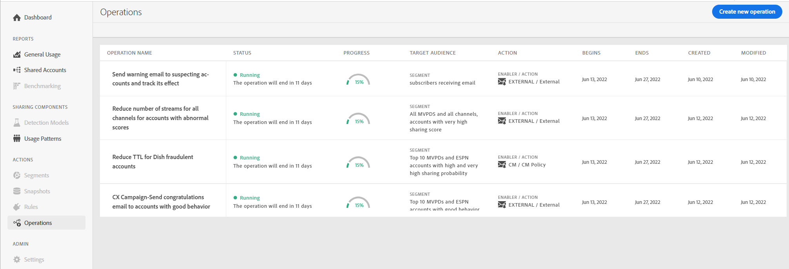
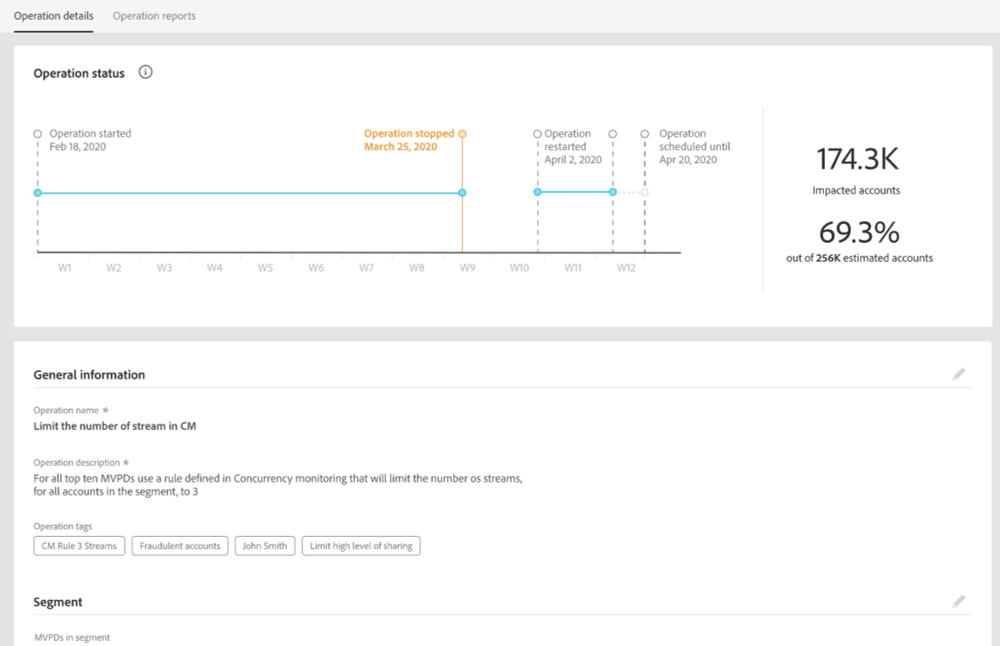

# Operationer {#operations-tab-next-steps}

När du har förstått dina abonnenters användningsmönster och identifierat lösenordsdelning för det valda segmentet (med rapporter och analyser i konto-IQ) kan du vidta riktade åtgärder för att minska lösenordsdelningen.

Funktionerna för åtgärder i konto-IQ hjälper dig att effektivt hantera och hantera delning av autentiseringsuppgifter genom fokuserade procedurer som kallas operationer. Här finns alternativ för att utforma en objektiv, skräddarsy riktade åtgärder (baserat på målet) för en viss grupp av abonnentkonton och automatisera deras utförande för en framtida varaktighet. Genom funktionerna kan ni inte bara skapa och utföra åtgärder, utan även mäta deras påverkan. Genom att mäta påverkan kan ni anpassa er strategi för att optimera effekten, vare sig det gäller konvertering av låntagare eller reducering av delning av autentiseringsuppgifter.

Visa **Operationer** sidmarkering **Operationer** option under **Åtgärder** i vänster navigering i kontots IQ-program. På sidan Åtgärder visas alla åtgärder som redan finns på konto-IQ-systemet tillsammans med deras information.

*Bild: Lista och information om befintliga åtgärder i konto-IQ*

På sidan Åtgärder kan du:

* Visa en lista över åtgärder som redan finns i konto-IQ

* Visa åtgärdsinformation, till exempel:

   * status (Schemalagd, Körs, Avslutad, Fel eller Stoppad)

   * förlopp (i procent klart)

   * målgrupp (segment som åtgärden ska köras på)

   * schema (start- och slutdatum för åtgärden)

   * datum då operationen skapades och avslutades

* [Skapa ny åtgärd](/help/AccountIQ/operation-affecting-user-segment.md)

* [Visa åtgärdsrapporter](#operation-reports)

<!--* Search from the list of operations using Search field

* Stop an operation.

* Create a duplicate operation.

* [Configure columns of Operations details page](#configure-columns)-->

## Visa åtgärdsrapporter {#operation-reports}

Du kan analysera effekterna av en åtgärd genom att visa dess rapport. Så här visar du en åtgärdsrapport:

1. Markera åtgärdsnamnet på huvudsidan.

   Rapporten visas i form av ett skiktat stolpdiagram.

   

   *Bild: Verksamhetsrapport för att visa verksamhetens konsekvenser*

   X-axeln representerar utvärderingsperioden och y-axeln beskriver åtgärdens inverkan (i antal konton i ett segment under utvärderingsperioden). Varje stapel är uppdelad i tre delar.

   * En del representerar antalet konton som fortfarande uppfyller operationssegmentets villkor.

   * En annan del representerar antalet aktiva konton för den perioden som ursprungligen fanns i segmentet, men som inte längre uppfyller operationssegmentets villkor.

   * Den tredje delen representerar konton som inte var aktiva under den perioden.
   >[!NOTE]
   >
   >Den första raden representerar antalet konton som uppfyller villkoren för operationssegmentet i början av utvärderingsperioden.

   Med tiden visar diagrammet effekten av åtgärden (genom åtgärden) genom att ange antalet konton som har ändrat beteendet i förhållande till de ursprungliga kriterierna (till exempel med en delningssannolikhet på mer än 90 och som använder fler än 5 enheter) eller har blivit inaktivt.

<!--For example, in the above image the variable on the y-axis is number of accounts. Looking at the graph you can compare the number of accounts that are in the operations' segment versus the number of accounts that are outside the operations segment at a particular time (such as week 2nd of the operations evaluation period). Therefore, you can analyze how over the evaluation period do number of accounts vary within the operation segment and outside the segment.

So, if your operation was to send out warning emails to suspecting accounts, and accounts in operations segment were those with sharing probability more than 90 and using more than 5 devices to stream content, then in the beginning of the evaluation period accounts in segment are more than 17 thousand. This number changes over the evaluation period as shown in the graph, thereby indicating the impact of operation. Based on the evaluation, you can take remedial measures on suspecting accounts, or continue with the operation, or adjust your strategy for better outcomes to curb credential sharing.-->

1. Om du vill stänga rapporten och gå tillbaka till huvudsidan väljer du **Operationer** option under **Åtgärder** i vänster navigering.

<!--

*Figure: Operation details*
## Configure columns {#configure-columns}

You can select the icon to **Configure columns** on the top of the operations table.

*Figure: Configure columns of Operations details page*-->