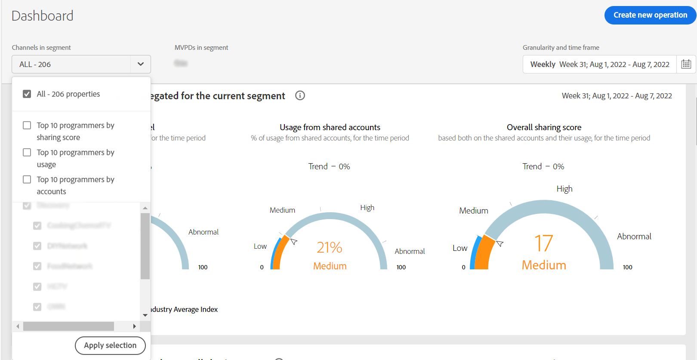

# Prenumerationssegment och tidsram {#cohorts-segments}

När du loggar in på konto-IQ finns det en panel längst upp där du kan definiera prenumeranten [segment](/help/AccountIQ/product-concepts.md#segment-segmet-def) om du vill filtrera resultaten för att visa rapporter för abonnenternas delningsbeteende och mönster.

<!---->

+++Segmentmarkeringspanel för programmerare

<!---->

Följande listrutealternativ används för att definiera segment:

**MVPD i segment**

The **MVPD i segment** väljer du [MVPD](/help/AccountIQ/product-concepts.md#mvpd-def) (personer eller grupp) vars prenumerant du vill visa rapporterna om kontodelning för.

I den här väljaren kan du förutom att markera de enskilda programmeringsversionerna även välja följande grupper:
* [Top 10 MVPDs by sharing score](/help/AccountIQ/product-concepts.md#top-mvpds-def)

* [De 10 viktigaste videobandspelare per användning](/help/AccountIQ/product-concepts.md#top-mvpds-def)

* [De 10 viktigaste versionerna per konto](/help/AccountIQ/product-concepts.md#top-mvpds-def)

* [Isoleringsläge](/help/AccountIQ/isolation-mode.md)

**Kanaler i segment**

När du är inloggad som programmerare kan du välja dina kanaler för att visa deras kontodelningsanalys. Använd **Kanaler i segment** i listrutan för att välja enskilda eller flera kanaler i organisationen.

+++

+++Segmentmarkeringspanel för sidoskydd

**Kanaler i segment**

The **Kanaler i segment** Med väljaren kan du begränsa filtret ytterligare för att markera kanaler som motsvarar de valda programmeringsgränssnitten.

* [De 10 viktigaste programmerarna genom att dela poäng](/help/AccountIQ/product-concepts.md#top-mvpds-def)

* [De 10 viktigaste programmerarna efter användning](/help/AccountIQ/product-concepts.md#top-mvpds-def)

* [De 10 viktigaste programmerarna per konto](/help/AccountIQ/product-concepts.md#top-mvpds-def)

**MVPD i segment**

När du är inloggad som en MVPD-användare visas ditt namn i fältet för **MVPD i segment**.

+++

<!--For example, you can define your segment as the "subscribers of the MVPD A that watched the channels X, Y, and Z".-->

* **Kornighet och tidsram**

   The **Kornighet och tidsram** Med väljaren kan du ange datum och varaktighet, eller tidsstorlek som du vill visa delningsbeteendet för prenumeranter.

Med de här kontrollerna kan du definiera din problemlösning som&quot;prenumeranter på MVPD A som tittade på kanalerna X, Y och Z i maj-månaden&quot;.

