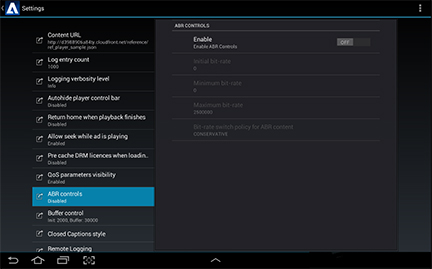

# Visa QoS-uppspelning och enhetsstatistik {#display-qos-playback-and-device-statistics}

Du kan ställa in spelaren så att den läser uppspelnings- och enhetsstatistik från QoSProvider så ofta som behövs.

Klassen innehåller olika statistik, bland annat bildrutefrekvens, profilens bithastighet, den totala buffringstiden, antalet buffringsförsök, den tid det tog att hämta den första byten från det första videofragmentet, den tid det tog att återge den första bildrutan, den buffertlängd som för tillfället används och bufferttiden. `QoSProvider`

Referensimplementeringen innehåller en `QoSManager` klass där du kan aktivera visning av QoS-övertäckningen. Du kan även aktivera QoS-synligheten i användargränssnittet för inställningar:

Spåra QoS-statistik genom att hämta enhetsinformation, ansluta till mediespelaren och uppdatera med den senaste QoS-informationen. `QoSManager`

**Aktivera eller inaktivera rapportering av QoS-statistik**

1. Skapa en QosManager eller aktivera QoS-rapportering med ManagerFactory.

   * Så här skapar du en QosManager:
      * Det här programmet måste använda arbetsflödesfunktionen för annonsering
   QoSManager qosManager = new QosManagerOn();

   * Så här använder du en ManagerFactory för att aktivera visning av QoS-statistik:
   qosManager = ManagerFactory.getQosManager()
   <b>true</b>, config, mediaPlayer);

   >[!NOTE]
   >
   >Om du ändrar booleskt till `false` inaktiveras QoS-rapportering.

2. Lägg till händelseavlyssnare:

   `qosManager.addEventListener(qosManagerEventListener);`

3. Skapa QoS-providern och koppla den till spelarens aktivitetskontext:

   `qosManager.createQOSProvider(getActivity());`

   >[!NOTE]
   >
   >När spelaraktiviteten ska tas bort måste du anropa [qosManager.destroyQOSProvider](https://help.adobe.com/en_US/primetime/reference_implementation/android/javadoc/com/adobe/primetime/reference/manager/QosManager.html#destroyQOSProvider()) för att rensa upp QOS-providern genom att koppla loss den från mediespelaren.

**Relaterad API-dokumentation**

* [QosManager-klass](https://help.adobe.com/en_US/primetime/api/reference_implementation/android/javadoc/com/adobe/primetime/reference/manager/QosManager.html)
* [Klassen QosManagerOn](https://help.adobe.com/en_US/primetime/api/reference_implementation/android/javadoc/com/adobe/primetime/reference/manager/QosManagerOn.html)
* [QosManagerEventListener](https://help.adobe.com/en_US/primetime/api/reference_implementation/android/javadoc/com/adobe/primetime/reference/manager/QosManager.QosManagerEventListener.html)
* [QosItem](https://help.adobe.com/en_US/primetime/api/reference_implementation/android/javadoc/com/adobe/primetime/reference/manager/QosManager.QosItem.html)
