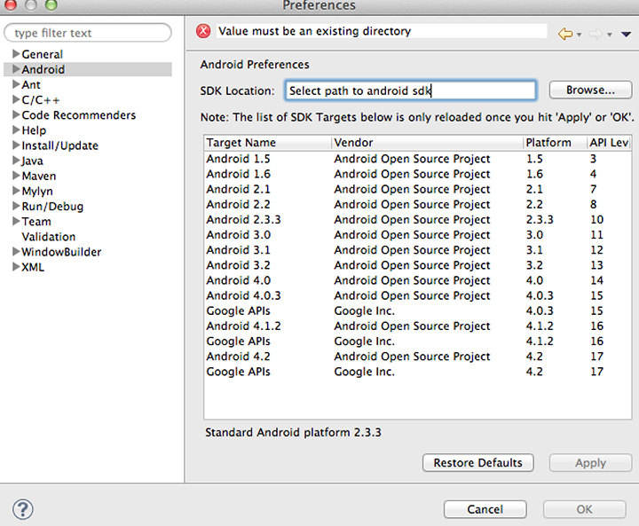

# Hämta och konfigurera nödvändig programvara {#download-and-configure-prerequisite-software}

1. Hämta JDK från [https://www.oracle.com/technetwork/java/javase/downloads/](https://www.oracle.com/technetwork/java/javase/downloads/).

   Installationsprocessen är enkel. Om du redan har JDK installerat på datorn kan du hoppa över det här steget, men tänk på att JDK, Eclipse IDE och OS måste vara kompatibla.
1. Hämta Eclipse IDE för Java-utvecklare från [https://www.eclipse.org/downloads](https://www.eclipse.org/downloads).

   När du har packat upp paketet kan du köra Eclipse direkt. Det finns inget installationsprogram.
1. Hämta Android SDK ADT Bundle från [https://developer.android.com/sdk/index.html](https://developer.android.com/sdk/index.html).

   Paketet innehåller Eclipse. Om du redan har Eclipse installerat på datorn kan du hämta SDK-verktygen för plattformen från [!UICONTROL Use An Existing IDE]-avsnittet.

   Packa upp och installera på en plats som du kommer ihåg. Du måste hänvisa till detta i ett senare steg.
1. Konfigurera Android SDK.
   1. Öppna en terminal (i Mac OS X) eller en kommandotolk (i Windows).
   1. Navigera till katalogen där du hämtade/packade upp Android SDK.
   1. Gå till mappen tools, som innehåller en fil med namnet [!DNL android].
   1. Kör följande kommandon:

      * För Mac OS X/Unix:

         ```
         chmod +x android 
         android update sdk --no-ui
         ```

      * För Windows:

         ```
         android update sdk --no-ui
         ```

         Den här processen tar ett tag.

1. Konfigurera Eclipse.
   1. Starta Eclipse.

      Om Eclipse inte startar i Windows och felet som rapporteras är att Eclipse inte kan hitta en nödvändig Java-fil kan du försöka med följande:

      * lägg till `-vm C:\[path to your JDK bin]\javaw.exe` i din [!DNL eclipse.ini]-fil.
   1. Välj **[!UICONTROL Help]** > **[!UICONTROL Install New Software]**.
   1. Klicka på **[!UICONTROL Add...]**.
   1. Ange `Android` som namn.
   1. Ange `https://dl-ssl.google.com/android/eclipse/` som **[!UICONTROL Work with]**-länk.
   1. Klicka på **[!UICONTROL OK]**.

      Du bör se en dialogruta som ser ut så här:

      

   1. Markera de färdiga paketen (de i Utvecklarverktyg och NDK-plugin-program) och klicka på **[!UICONTROL Next]**.

      Detta hämtar Android Development Tools (ADT).
   1. Starta om Eclipse när hämtningen är klar.

   Android SDK är nu installerat. 1. Konfigurera Eclipse så att Android SDK kan hittas och användas som en resurs.
   1. Öppna Eclipse.
   1. Välj **[!UICONTROL Window]** > **[!UICONTROL Preferences]** i Windows;  **[!UICONTROL ADT]** > **[!UICONTROL Preferences]** i Mac OS X.
   1. Välj fliken **[!UICONTROL Android]**.
   1. Bläddra till platsen för Android SDK.
   1. Klicka på **[!UICONTROL Apply]**.

      


