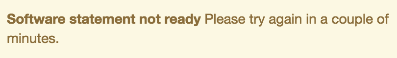

# Registreringshantering för dynamisk klient {#dynamic-client-registration-management}

>[!NOTE]
>
>Innehållet på den här sidan tillhandahålls endast i informationssyfte. Användning av denna API kräver en aktuell licens från Adobe. Ingen obehörig användning är tillåten.

## Översikt {#overview}

I och med den omfattande användningen av [Android Chrome, anpassade flikar](https://developer.chrome.com/multidevice/android/customtabs){target_blanck} och [Apple Safari View Controller](https://developer.apple.com/documentation/safariservices/sfsafariviewcontroller){target_blanck} i våra kunders program uppdaterar användarautentiseringsflödet i Adobe Primetime Authentication. Mer specifikt kan vi inte längre uppnå målet att behålla tillståndet så att användaragentflödet för autentisering av en MVPD-prenumerant kan spåras mellan omdirigeringar. Detta har tidigare gjorts med HTTP-cookies. Den här begränsningen är drivrutinen för att börja migrera alla API:er till OAuth 2.0 [RFC6749](https://tools.ietf.org/html/rfc6749){target_blanck}.

Med den här uppdateringen blir autentiseringsklienter för Adobe OAuth 2.0-klienter och en anpassad OAuth 2.0-auktoriseringsserver distribueras för att tillgodose behoven i Adobe Primetime autentiseringstjänst.

För att klientprogrammen ska kunna utnyttja OAuth 2.0-auktoriseringen måste servern registrera sig dynamiskt för att få specifik information (klientautentiseringsuppgifter) för att kunna interagera med den. Som en del av registreringsprocessen måste klienten presentera en uppsättning inbyggda metadata för klientregistreringens slutpunkt.

Dessa metadata kommuniceras som en programsats, som innehåller ett &quot;software_id&quot; som gör att vår autentiseringsserver kan korrelera olika instanser av ett program med samma programsats.

A **programsats** är en JSON Web Token (JWT) som bekräftar metadatavärden om klientprogramvaran som ett paket. När programsatsen skickas till auktoriseringsservern som en del av en klientregistreringsbegäran måste den signeras digitalt eller MACed med JSON Web Signature (JWS).

Du hittar en mer detaljerad förklaring om vilka programsatser som är och hur de fungerar i den officiella dokumentationen [RFC7591](https://tools.ietf.org/html/rfc7591).

Programsatsen ska distribueras med programmet på användarens enhet.

Före den här uppdateringen hade vi två mekanismer för att tillåta program att utföra anrop till Adobe Primetime-autentisering:

* webbläsarbaserade klienter registreras via tillåtet [domänlista](/help/authentication/programmer-overview.md#reg-and-init)
* Inbyggda programklienter, som iOS och Android-program, registreras via **undertecknad beställare** mekanism

Med auktoriseringsfunktionen för klientregistrering måste du lägga till dina program på TVE-kontrollpanelen.

För att en kund ska kunna börja implementera nya Android SDK och kommande iOS SDK krävs en programsats. En programsats identifierar ett program som skapats i TVE Dashboard.

Följ stegen nedan för att skapa ett registrerat program på TVE Dashboard.

## Skapa ett registrerat program {#create_app}

Du kan skapa ett registrerat program på två sätt i TVE Dashboard:

* [Programmeringsnivå](#prog-level) - gör att du kan skapa ett registrerat program och länka det till någon eller alla programmeringskanaler.

* [Kanalnivå](#channel-level) - gör att du kan skapa ett registrerat program som är permanent länkat till enbart den här kanalen.

### Skapa ett registrerat program på programmeringsnivå {#prog-level}

Gå till **Programmerare** > **Registrerade program** -fliken.

På fliken Registrerade program klickar du på **Lägg till nytt program**. Fyll i de obligatoriska fälten i det nya fönstret.

Som du ser i bilden nedan är fälten som du ska fylla i:

* **Programnamn** - namnet på programmet

* **Tilldelad till kanal** - namnet på kanalen, tsom det här programmet är länkat till. Standardinställningen i den nedrullningsbara masken är **Alla kanaler.** I gränssnittet kan du välja en eller flera kanaler.

* **Programversion** - som standard är detta inställt på &quot;1.0.0&quot;, men vi rekommenderar starkt att du ändrar det med din egen programversion. Om du bestämmer dig för att ändra programversionen bör du tänka på det genom att skapa ett nytt registrerat program för det.

* **Programplattformar** - de plattformar som programmet ska länkas till. Du kan markera alla eller flera värden.

* **Domännamn** - domänerna som programmet ska länkas till. Domänerna i listrutan är ett enhetligt urval av alla domäner från alla kanaler. Du kan välja flera domäner i listan. Innehållet i domänerna är omdirigerings-URL:er [RFC6749](https://tools.ietf.org/html/rfc6749). I klientregistreringsprocessen kan klientprogrammet begära att få använda en omdirigerings-URL för att slutföra autentiseringsflödet. När ett klientprogram begär en viss omdirigerings-URL valideras den mot de domäner som vitlistas i det här registrerade programmet som är kopplat till programsatsen.

När du har fyllt i fälten med lämpliga värden måste du klicka på Klar för att programmet ska sparas i konfigurationen.

Observera att det finns **inget alternativ för att ändra ett redan skapat program**. Om det upptäcks att något som skapats inte längre uppfyller kraven måste ett nytt registrerat program skapas och användas tillsammans med klientprogrammet vars krav det uppfyller.

### Registrera ett nytt program på kanalnivå {#channel-level}

Om du vill skapa ett registrerat program på kanalnivå går du till menyn Kanaler och väljer det program som du vill skapa ett program för. När du har navigerat till fliken &quot;Registrerade program&quot; klickar du sedan på knappen &quot;Lägg till nytt program&quot;.

Så som visas nedan är det något annorlunda här, jämfört med samma åtgärd som utfördes på programmeringsnivå, den nedrullningsbara listan&quot;Tilldelade kanaler&quot; som inte är aktiverad, så det finns inget alternativ för att binda det registrerade programmet till en annan kanal än den aktuella.

## Lista program {#list-reg-app}

När du har skapat det registrerade programmet kan du hämta en programsats som presenterar auktoriseringsservern som en del av en begäran.

Detta kan du göra genom att navigera antingen till den programmerare eller kanal som de registrerade programmen skapades för, där de listas. 

Som framgår nedan kommer alla poster i listan att identifieras med namn, version och symboler för de plattformar som de binds till.

För var och en av dem kan du:

* [Visa](#view)
* [Ladda ned en programsats](#download-statement)

### Visa ett registrerat program {#view}

Om du väljer ett av programmen i listan och klickar på knappen &quot;Visa&quot; visas den information som användes när programmet skapades. Som tidigare nämnts finns det inget alternativ för att ändra något.

### Ladda ned programsats {#download-statement}

Om du klickar på knappen &quot;Ladda ned&quot; på den listpost för vilken en programsats behövs genereras en textfil. Den här filen kommer att innehålla något som liknar exempelutdata nedan.

Filens namn identifieras unikt genom att prefix anges med &quot;software_statement&quot; och den aktuella tidsstämpeln läggs till.

Observera att för samma registrerade program kommer olika programsatser att tas emot varje gång som nedladdningsknappen klickas, men detta medför inte att tidigare programsatser för det här programmet blir ogiltiga. Det beror på att de genereras på plats, per åtgärdsbegäran.

Det finns en **begränsning** om nedladdningsåtgärden. Om du tillfrågas om en programsats genom att klicka på knappen &quot;Ladda ned&quot; kort efter att du skapat det registrerade programmet och den här programsatsen ännu inte sparats och konfigurationsjson inte synkroniserats, visas följande felmeddelande längst ned på sidan. 

Detta omsluter en HTTP 404 Hittade inte felkod som hämtats från kärnan eftersom ID:t för det registrerade programmet ännu inte har spridits och kärnan inte har någon kunskap om det.

När du har skapat det registrerade programmet väntar du i högst två minuter på att konfigurationen ska synkroniseras. När detta inträffar kommer felmeddelandet inte längre att tas emot och textfilen med programsatsen kommer att vara tillgänglig för hämtning.

Mer information om hur slutprocessen fungerar, eller om du vill få en inblick i hur förfrågningarna utförs och vilka svar som förväntas, finns i länken Relaterad information nedan, tillsammans med andra användbara länkar.

<!--
## Related Information {#related}

* [Dynamic Client Registration API](/help/authentication/dynamic-client-registration-api.md)
* [TVE Dashboard User Guide](/help/authentication/tve-dashboard-user-guide.md)
-->

## Demo {#tutorial}

Titta [det här webbinariet](https://my.adobeconnect.com/pzkp8ujrigg1/) som ger ett större sammanhang för funktionerna och innehåller en demonstration av hur programsatser ska hanteras med TVE Dashboard och hur de genererade programsatserna ska testas med ett demoprogram som tillhandahålls av Adobe som en del av Android SDK.
