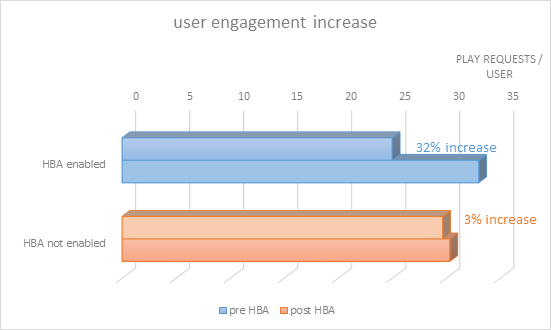

# Hembaserad autentisering för TV överallt

>[!NOTE]
>
>Innehållet på den här sidan tillhandahålls endast i informationssyfte. Användning av denna API kräver en aktuell licens från Adobe. Ingen obehörig användning är tillåten.

## Vad är hembaserad autentisering? {#whatis-home-based-authn}

HBA (Home Based Authentication) är en TV Everywhere-funktion som gör att betal-TV-prenumeranter kan visa tv-innehåll online utan att ange MVPD-autentiseringsuppgifter när de är hemma, vilket avsevärt förbättrar användarupplevelsen av autentiseringsflödet.

Hembaserad autentiseringsdefinition av OATC (Open Authentication Technology Committee):&quot;Automatisk autentisering hemma är den process genom vilken ett MVPD/OVD använder hemnätverkets egenskaper (eller identifierare som automatiskt är tillgängliga mellan enheter i hemnätverket) för att autentisera vilket prenumerantkonto som är kopplat till hemnätverket så att användarna inte behöver ange inloggningsuppgifter manuellt när de skapar en TVE-session för åtkomst till TVE-skyddat innehåll.&quot;

Mer information om HBA och branschstandarderna finns i [OATC - Användningsexempel och krav](https://dzf8vqv24eqhg.cloudfront.net/userfiles/258/326/ckfinder/files/Defining%20TVE%20Home-Based%20Authentication%20(HBA)%20%20Use%20Cases%20and%20Requirements%20Recommended%20Practice%20Version%201_0%20FINAL%20DRAFT%20FOR%20BOARD%20APPROVAL.pdf){target=_blank} dokumentation och **OATC User Experience Guidelines for HBA**.

>[!NOTE]
>
>Vissa HBA-flöden ingår i Premium Workflow-paketet. Kontakta din säljare på Primetime om du vill använda den här funktionen.

## Därför är HBA viktigt för dig {#why-hba}

HBA är viktigt eftersom det praktiskt taget tar bort inloggningsbarriären för tittarna som är hemma och redan har en kabelprenumeration. Hembaserad autentisering kan också avsevärt öka tittarnas engagemang och ge en bättre användarupplevelse för ert TV Everywhere-innehåll.

För närvarande lyckas nästan hälften av försöken att logga in inte.

När värdbussadaptern aktiverats av en av de fem bästa videoprogrammeringsarna konverteringsgraden för autentisering **ökade med 40 %** (från 45 % till 63 %)

Nedan ser du också inloggningskonverteringsgraden för en kanal som är integrerad med olika MVPD-program: de som har aktiverat HBA för den och de som inte har HBA. Konverteringsgraden för dem med HBA är betydligt högre än för dem utan HBA.

Sex månader efter att vi aktiverat HBA för de flesta kanaler som är integrerade med detta MVPD har vi märkt en 82-procentig ökning av antalet unika användare (antalet användare som använder TV Everywhere-kanalerna via detta MVPD nästan fördubblats).

2w3Som du kan se i diagrammet nedan så har andra videoprogrammeringsprogram som inte hade aktiverat HBA bara ökat med 26 % bland de unika användarna under de senaste sex månaderna.

Från våra data, som samlats in 6 månader före och 6 månader efter att HBA aktiverats, har vi sett en stor ökning av tittarnas engagemang för de kanaler som var HBA-aktiverade. Praktiskt taget alla användare från MVPD som har aktiverat HBA tenderar att se i genomsnitt 30 % mer innehåll än de som inte har HBA aktiverat.

## Stöd för HBA-autentisering med primär tid {#auth-hba-support}

I det här avsnittet beskrivs HBA-stödet från Primetime-autentisering, beteendet hos Primetimes autentiseringsplattformar i HBA-flöden och även teknisk information som är användbar vid implementering av HBA.

Autentiseringsfunktioner i Primetime som stöder HBA

* Möjlighet att ange olika autentiserings-TTL för HBA jämfört med icke-HBA-autentiseringar (kräver också stöd för MVPD)
* Möjlighet att automatiskt välja en MVPD-väljare (hoppa över MVPD-väljaren) om autentiseringen gick ut. Detta är praktiskt särskilt när HBA TTL är små.
* Möjlighet att visa programmerarna om autentiseringen var HBA eller inte (kräver också stöd för MVPD)

### HBA-användarupplevelse på plattformar för Primetime-autentisering {#hba-user-exp}

Följande tabeller innehåller information om användarupplevelsen för de plattformar som stöds när HBA är aktiverat och när HBA inte är aktiverat:

| Användarflöde - Plattformstyp | swf, iOS, Android |
|---|---|
| Med HBA aktiverat | När användarna är hemma autentiseras de automatiskt. När HBA AuthN-token har upphört att gälla autentiseras användarna automatiskt. |
| Utan HBA | Användarna uppmanas att välja sitt MVPD och ange sina autentiseringsuppgifter, även om de är hemma. När AuthN-token har upphört att gälla måste användarna ange sina autentiseringsuppgifter igen. |

| Användarflöde - Plattformstyp | js, Windows (inbyggt) |
|---|---|
| Med HBA aktiverat | När användarna är hemma autentiseras de automatiskt. När HBA AuthN-token har upphört att gälla måste användaren välja sitt MVPD igen från väljaren och autentiseras automatiskt. |
| Utan HBA | Användarna uppmanas att välja sitt MVPD och ange sina inloggningsuppgifter, även om de är hemma. När AuthN-token har upphört att gälla måste användaren ange sina inloggningsuppgifter igen. |

| Användarflöde - Plattformstyp | Klientlös REST API (autentisering på andra skärmen) |
|---|---|
| Med HBA aktiverat | När användare är hemma och använder en klientlös REST API-app autentiseras de automatiskt på den andra skärmenheten efter att registreringskoden har angetts och deras MVPD-fil har valts. När HBA AuthN-token upphör att gälla återautentiseras användare automatiskt (på den andra skärmenheten). |
| Utan HBA | Användarna uppmanas att välja sitt MVPD och ange sina inloggningsuppgifter, även om de är hemma. När AuthN-token har upphört att gälla måste användaren ange sina inloggningsuppgifter igen. |

### Teknisk information om implementering av värdbussadapter {#tech-details-hba}

#### OAuth 2.0-protokoll {#oauth-2-protocol}

I HBA-flödet för MVPD-program som är integrerade med OAuth 2.0-autentiseringsprotokollet utfärdar MVPD en uppdateringstoken och Adobe utfärdar en HBA-autentiseringstoken:

* Uppdateringstoken har en TTL som bestäms av affärskraven för MVPD.
* TTL för HBA-autentiseringstoken **måste vara mindre än eller lika med** uppdateringstoken TTL.

*Beskrivning av HBA-autentiseringsflödet för OAuth 2.0-protokollet*

| Användaråtgärder | Systemåtgärder |
|---|---|
| Användaren navigerar till programmerarens webbplats. När du försöker spela upp en video visas MVPD-väljaren. Användaren väljer sin MVPD och klickar på Logga in. | En bakgrundskontroll utförs. MVPD tillämpar sina regler för användaridentifiering (mappa till exempel användarens IP-adress till MAC-adressen för distributörsetablerade modem eller bredbandsanslutna digitalboxar). |
| En skärm som visas i cirka 3 sekunder visas. En interstitiell sida kan visas som informerar användaren om att han/hon automatiskt loggas in med hjälp av sitt MVPD-konto. | <ol><li>AccessEnabler, som är installerat på programmeraren, skickar en autentiseringsbegäran (som en HTTP-begäran) till slutpunkten för Adobe Primetime-autentisering.</li><li>Slutpunkten för Primetime-autentisering dirigerar om begäran till slutpunkten för MVPD-autentisering.  **Obs!** Begäran innehåller `hba_flag` parameter (försök HBA = true) som signalerar att MVPD ska försöka autentisera HBA.</li><li>Slutpunkten för MVPD-autentisering skickar en auktoriseringskod till slutpunkten för Adobe Primetime-autentisering.</li><li>Adobe Primetime Authentication använder auktoriseringskoden för att begära en uppdateringstoken och en åtkomsttoken från MVPD:s tokenslutpunkt.</li><li>MVPD skickar ett autentiseringsbeslut och `hba_status` (true/false) i parametern `id_token`.</li><li>Ett anrop till slutpunkten för MVPD-användarprofilen skickas för att visa [hba_status-nyckel i användarens metadata](/help/authentication/user-metadata-feature.md#obtaining).</li><li>MVPD ställer in TTL för uppdateringstoken till ett MVPD-överenskommet värde och Adobe ställer in AuthN-token TTL till ett värde som är mindre eller lika med uppdateringstokens värde.</li></ol> |
| Användaren är autentiserad och kan nu bläddra bland det berättigade TV Everywhere-innehållet. | Autentiseringstoken skickas till användaren som nu kan bläddra på programmerarens webbplats. |

#### SAML-protokoll {#saml-protocol}

Beskrivning av HBA-autentiseringsflödet för SAML-autentiseringsprotokollet

| Användaråtgärder | Systemåtgärder |
|---|---|
| Användaren navigerar till programmerarens webbplats. När du försöker spela upp en video visas MVPD-väljaren. Användaren väljer sin MVPD och klickar på Logga in. | En bakgrundskontroll utförs. MVPD tillämpar sina regler för användaridentifiering (mappa till exempel användarens IP-adress till MAC-adressen för distributörsetablerade modem eller bredbandsanslutna digitalboxar). |
| En skärm som visas i cirka 3 sekunder visas. En interstitiell sida kan visas som informerar användaren om att han/hon automatiskt loggas in med hjälp av sitt MVPD-konto. | <ol><li>AccessEnabler, som är installerat på programmeraren, skickar en autentiseringsbegäran (som en HTTP-begäran) till slutpunkten för Adobe Primetime-autentisering.</li><li>Slutpunkten för Primetime-autentisering dirigerar om begäran till slutpunkten för MVPD-autentisering.</li><li>MVPD ska skicka ett autentiseringsbeslut i form av ett SAML-svar som ska innehålla HBA-flaggan: hba_status (true/false).</li><li>Ett anrop till slutpunkten för MVPD-användarprofilen skickas för att visa [hba_status-nyckel i användarens metadata](/help/authentication/user-metadata-feature.md#obtaining).</li></ol> |
| Användaren är autentiserad och kan nu bläddra bland det berättigade TV Everywhere-innehållet. | Autentiseringstoken skickas till användaren som nu kan bläddra på programmerarens webbplats. |

## Så här aktiverar du HBA {#how-to-activate-hba}

* **OAuth-protokoll:**
   * Information om hur du aktiverar HBA finns i [Användarhandbok för Primetime TVE Dashboard](/help/authentication/tve-dashboard-user-guide.md)
* **SAML-protokoll:** Hembaserad autentisering aktiveras på MVPD-sidan. Programmeraren eller Adobe kräver inga åtgärder.
Mer information om de videofilmsprogram som stöder hembaserad autentisering finns i [HBA-status för MVPD](/help/authentication/hba-status-mvpds.md).

## Vanliga frågor {#faqs}

**Fråga:** Varför separationen mellan Home Based Authentication med SAML- och OAuth2-protokoll?

**Svar:** HBA-flödet är annorlunda för de två protokollen. Ur programmerarens perspektiv finns det inget behov av åtgärder för att säkerställa att HBA är aktiverat för SAML MVPD, medan HBA för OAuth2 MVPD kan aktiveras eller inaktiveras i Primetimes TVE Dashboard.

**Fråga:** Måste användare fylla i användarnamn och lösenord första gången de autentiserar när HBA är aktiverat?

**Svar:** Nej, användarnamn och lösenord krävs inte.

**Fråga:** Hur tillämpar man föräldrakontroll?

**Svar 1:** Adobe kan inaktivera värdbussadaptern för integrering med kanaler som behöver godkännas för föräldrakontroll.

**Svar 2:** Adobe arbetar med OATC i ett UX-dokument som rekommenderar hur man skapar HBA-upplevelsen med föräldrakontroll.

**Fråga:** Har leverantörerna som stöder HBA kortare TTL-fönster för HBA än de gör för vanlig autentisering?

**Svar:** TTL-inställningen kan konfigureras. Vi rekommenderar att du anger en kortare TTL för HBA-autentiseringstoken för att förhindra felhantering.

## Användbar information {#useful-info}

* [HBA (Instant Access) Recommendations](http://www.ctamtve.com/instantaccess){target=_blank} - av CTAM
* [Exempel på implementering av HBA i programmerarapp](https://dzf8vqv24eqhg.cloudfront.net/userfiles/258/326/ckfinder/files/HBA_Flow_Sample.pdf?dc=201604222139-1346){target=_blank} - av Adobe
  <!--* [Home Based Authentication User Experience Guidelines for TV Everywhere](http://oatc.us/Standards/DownloadRecommendedPractices.aspx){target=_blank} - by OATC-->
* [Hembaserad autentisering - Användningsfall och krav](https://dzf8vqv24eqhg.cloudfront.net/userfiles/258/326/ckfinder/files/Defining%20TVE%20Home-Based%20Authentication%20(HBA)%20%20Use%20Cases%20and%20Requirements%20Recommended%20Practice%20Version%201_0%20FINAL%20DRAFT%20FOR%20BOARD%20APPROVAL.pdf){target=_blank} av OATC
* [Hembaserad autentiseringsinformation](https://dzf8vqv24eqhg.cloudfront.net/userfiles/258/326/ckfinder/files/AdobeNewsletterHBA.pdf?dc=201604260953-2640){target=_blank} - av Adobe
* [Autentisering med OAuth 2.0-protokollet](/help/authentication/authn-oauth2-protocol.md)
* [Autentisering med SAML MVPD](/help/authentication/authn-usecase.md)
* [Användarhandbok för Primetime TVE Dashboard](/help/authentication/tve-dashboard-user-guide.md)
* [hba_status Användarmetadata](/help/authentication/user-metadata-feature.md#obtaining)
