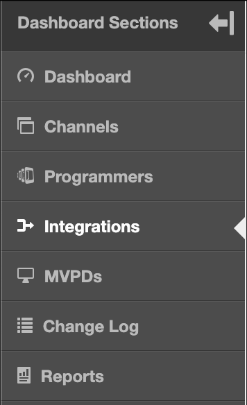

# Användarhandbok för Primetime TVE Dashboard {#tve-db-user-guide}

>[!NOTE]
>
>Innehållet på den här sidan tillhandahålls endast i informationssyfte. Användning av denna API kräver en aktuell licens från Adobe. Ingen obehörig användning är tillåten.

## Introduktion {#tve-db-intro}

[[!DNL Adobe] TVE Dashboard (TVE Dashboard)](https://console.auth.adobe.com/) är en självbetjäningsdashboard som riktar sig till användare som arbetar för medieföretag (programmerare) som har en affärsrelation med Adobe Primetime Authentication-produktgruppen.

Kontakta din kontoansvarige (TAM) för att få åtkomst. För att få åtkomst måste du ha två nya användargrupper konfigurerade i din Adobe Marketing Cloud-organisation:

* TVE Dashboard Read-Write - medlemmarna i den här gruppen har fullständig behörighet för alla redigerbara avsnitt i kontrollpanelen
* Skrivskyddad TVE Dashboard - medlemmarna i den här gruppen har endast visningsrättigheter för hela instrumentpanelen

Innan du börjar gå in på den här användarhandboken rekommenderar vi att du går igenom följande resurser för att få en god förståelse för de flöden och funktioner som Adobe Primetime Authentication-produktteamet erbjuder och för att bekanta dig med de termer som används i det här dokumentet:

* [TVE Technical Paper](/help/authentication/technical-paper.md)
* [Programmer Kickstart Guide](/help/authentication/programmer-kickstart-guide.md)
* [Tillståndsflöde](/help/authentication/entitlement-flow.md)
* [Ordlista](/help/authentication/glossary.md)

Om du fortsätter till nästa avsnitt i den här användarhandboken kommer du att upptäcka sätt att administrera olika inställningar för företagets kanaler, programmerare eller integreringar mellan kanaler och distributörer av videoprogram (Multichannel Video Program Distributors).

>[!IMPORTANT]
>TVE Dashboard ger möjlighet att växla mellan en grundläggande och en avancerad arbetsyta. Du kan göra detta genom att växla ikonen i det övre högra hörnet. Avancerad arbetsyta är avsedd för användare med omfattande teknisk kunskap och avancerade kunskaper om de funktioner som Adobe Primetime Authentication-produktteamet erbjuder.

*Bild 1: Listrutan Adobe Primetime TVE Dashboard &quot;Basic/Advanced Workspace&quot; (Grundläggande/Avancerad arbetsyta)*

## Miljö {#authn-environments}

Beroende på vilka uppgifter en användare kan behöva utföra kan han/hon behöva växla mellan Adobe Primetime autentiseringsmiljöer. Mer information om Adobe Primetime autentiseringsmiljöer finns i följande dokument: [Förstå Adobe Primetime autentiseringsmiljöer](/help/authentication/understanding-the-adobe-environments.md).

TVE Dashboard innehåller två miljöer som heter Prequal (Prekvalificering) och Release, där var och en har två profiler som heter Staging and Production, enligt nedan:

* [Föregående mellanlagring](https://console-prequal.auth-staging.adobe.com/)
* [Föregående produktion](https://console-prequal.auth.adobe.com/)
* [Frigör mellanlagring](https://console.auth-staging.adobe.com/)
* [Frigör produktion](https://console.auth.adobe.com/)

För att växla mellan miljöer kan användaren klicka på den miljö som posten från det nedrullningsbara elementet nedan representerar:

*Bild 2: Listrutan Adobe Primetime TVE Dashboard-miljöer*

>[!IMPORTANT]
>Observera att när du gör administrativa ändringar i din konfiguration för Adobe Primetime-autentisering via TVE Dashboard rekommenderar vi att du följer sekvensen nedan för att säkerställa att den fungerar som den ska.

Så här gör du administrativa ändringar i din konfiguration för Adobe Primetime-autentisering via TVE-instrumentpanelen:

* Utför ändringarna i [Frigör mellanlagring och validera dem](http://sp.auth-staging.adobe.com/apitest/api.html).
* Utför ändringarna i [Prequal Production och validera dem](http://sp.auth-staging.adobe.com/apitest/api.html).
* Utför ändringarna i [Frigör produktion och validera dem](http://sp.auth-staging.adobe.com/apitest/api.html).

>[!IMPORTANT]
>För att de administrativa ändringarna ska börja gälla måste användarna navigera till avsnittet Granska och push-ändra genom att markera knappen, som visas längst ned till vänster i sidofältet, för att granska ändringar, lägga till en beskrivning för de nyligen skapade ändringarna och bekräfta konfigurationsuppdateringen genom att välja Push Configuration (Push-konfiguration).

*Bild 3: Adobe Primetime TVE Dashboard Review and Push Changes notification*

## Avsnitt {#sections}

Användare som arbetar för medieföretag (programmerare) kan komma åt följande avsnitt i TVE Dashboard från sidofältet:

* **Kanaler** - Innehåller inställningar som är relaterade till innehållsleverantörer
* **Programmerare** - Innehåller inställningar som är relaterade till överordnad organisation som aggregerar en eller flera **Kanaler**
* **Integreringar** - Innehåller inställningar som är relaterade till integreringen mellan **Kanaler** och **MVPD**
* **MVPD** - Innehåller inställningar som är relaterade till tillgängliga **MVPD**
* **Rapporter** - Innehåller aggregerade data för tre typer av rapporter: AuthN TTL, AuthZ TTL, SSO
* **Ändringslogg** - Innehåller de senaste ändringarna som används i TVE Dashboard-konfigurationen

*Bild 4: Avsnitten i Adobe Primetime TVE Dashboard*

### Kanaler {#tve-db-channels-section}

I det här avsnittet kan du visa och redigera inställningar för tillgängliga kanaler eller skapa nya. Om du klickar på en av de tillgängliga kanalerna visas en skärm med följande flikar:

* **Kanaldata**
   * **Kanal-ID** - Kanalens unika ID som används i vårt system, kallas även för begärande-ID.
   * **Visningsnamn** - Kanalens kommersiella namn.
* **Allmänna inställningar**
   * **Analyskonfiguration** - Konfigurera Adobe Primetime-autentiseringshändelser som ska vidarebefordras till Adobe Analytics. Kontakta Adobe om du vill ha mer information om hur Report Suite-ID (RSID) måste konfigureras innan den här funktionen aktiveras.
* **Certifikat**

   Innehåller en lista över certifikat som används i autentiseringsflödet tillsammans med deras utfärdande organisation, utfärdandedatum och utgångsdatum. Dessa certifikat fungerar som privata/offentliga nycklar och används i valideringssyfte.
* **Domäner**

   Innehåller listan över domäner från vilka respektive kanal ska kommunicera med Adobe Primetime-autentisering.
* **Integreringar**

   Innehåller en lista över integreringar med tillgängliga programmeringsgränssnitt, tillsammans med statusen för varje integrering som kan vara aktiverad eller inte. Du kan navigera till integreringssidan genom att klicka på en viss post.
* **Registrerade program**

   Innehåller listan över programregistreringar. Mer information finns i dokumentet [Dynamisk hantering av klientregistrering](/help/authentication/dynamic-client-registration-management.md).

* **Anpassade scheman**

   Innehåller en lista med anpassade scheman. Mer information finns i [Registrering av iOS/tvOS-program](/help/authentication/iostvos-application-registration.md) och [Dynamisk hantering av klientregistrering](/help/authentication/dynamic-client-registration-management.md)

#### Lägg till/ta bort domäner {#add-delete-domains}

Om du vill börja lägga till en ny domän för den valda kanalen måste du klicka på knappen Lägg till ny domän under listan Domäner. Detta skapar en ny domänpost där du kan ange domännamnet. Om det redan finns en mer allmän domän i domänlistan bör du inte lägga till en ny underdomän.

*Bild: Fliken Domäner i kanaler*

### Programmerare {#tve-db-programmers-section}

I det här avsnittet kan du visa och redigera inställningar för tillgängliga programmerare eller skapa nya. Om du klickar på någon av de tillgängliga programmerarna visas en skärm med följande flikar:

* **Programmerardata**
   * **Programmer-ID** - Programmerarens unika ID som används i vårt system.
   * **Visningsnamn** - Programmerarens kommersiella namn.
   * **URL för logotyp** - Programmerarens logotyp för enhetlig resursposition (URL).
   * **Förhandsgranska logotyp** - Programmerarens kommersiella logotyp som förhandsvisas genom att den hämtas från den ovannämnda URL:en (Universal resource locator).

* **Certifikat**

   Innehåller en lista över certifikat som används i autentiseringsflödet tillsammans med deras utfärdande organisation, utfärdandedatum och utgångsdatum. Dessa certifikat fungerar som privata/offentliga nycklar och används i valideringssyfte.

* **Kanaler**

   Innehåller en lista med kanaler som tillhör den här specifika programmeraren. Du kan navigera till avsnittet Kanaler genom att klicka på en viss post.

* **Registrerade program**

   Innehåller listan över programregistreringar. Mer information finns i [Dynamisk hantering av klientregistrering](/help/authentication/dynamic-client-registration-management.md).

* **Anpassade scheman**

   Innehåller en lista med anpassade scheman. Mer information finns i [Registrering av iOS/tvOS-program](/help/authentication/iostvos-application-registration.md) och [Dynamisk hantering av klientregistrering](/help/authentication/dynamic-client-registration-management.md).

### Integreringar {#tve-db-integrations-sec}

I det här avsnittet kan du visa och redigera inställningar för integrering mellan kanaler och tillgängliga programmeringsvideofiler (MVPD) eller skapa en ny. Om du klickar på en av de tillgängliga integreringarna returneras en sida när du använder den grundläggande arbetsytan eller en skärm med följande flikar när du använder den avancerade arbetsytan:

* **Integreringsdata**
   * **Integration-ID**- Resultatet av att lägga till det unika ID:t för MVPD-filen till kanalens unika ID, avgränsat med tecknet &quot;_&quot;.
   * **Kanalvisningsnamn** - Kanalens kommersiella namn.
   * **Kanal-ID** - Kanalens unika ID som används i vårt system, kallas även för begärande-ID.
   * **MVPD-visningsnamn** - MVPD:s kommersiella namn.
   * **MVPD-ID** - MVPD:s unika ID som används i vårt system.
* **Allmänna inställningar**
   * **Användarmetadatanycklar** - Konfigurera metadatanycklar som är tillgängliga för den specifika integreringen.
   * **Plattformsspecifika inställningar** - Konfigurera olika inställningar för en viss plattform (till exempel TTL, SSO och IFrames).

* **Autentiseringsinställningar**
   * Innehåller inställningar som är relaterade till autentiseringsfunktionen för Adobe Primetime-autentisering.
* **Behörighetsinställningar**
   * Innehåller inställningar som är relaterade till auktoriseringsfunktionen för Adobe Primetime-autentisering.
* **Utloggningsinställningar**
   * Innehåller inställningar som är relaterade till inloggningsfunktionen för Adobe Primetime-autentisering.

#### Skapa integrering {#create-integration}

Följ stegen nedan för att skapa en ny integrering:

* klicka på knappen&quot;Lägg till ny integrering&quot;
* söka efter och välja en kanal
* söka efter och välja ett dokument för dokumentskydd
* vänta på att TVE Dashboard ska beräkna integrerings-ID och visa tillgängliga MVPD-slutpunkter
* välj autentiserings-, auktoriserings- och utloggningsslutpunkter eller använd standardvärden
* klicka på knappen &quot;Skapa integrering&quot;
* beroende på inställningarna för MVPD kan ett popup-fönster visas och du kan begära ytterligare egenskaper som ska ha angetts av MVPD i förväg, annars kommer en omdirigering till den nyligen skapade integrationssidan att utföras

*Figur 5. Fönstret Ny integrering i Adobe Primetime TVE Dashboard*

#### Uppdatera integrering {#update-integration}

Om du vill uppdatera en befintlig integrering klickar du på tabellposten för den specifika integreringen i avsnittet Integrationer eller i avsnittet Kanaler, som innehåller fliken Integrationer.

När du använder läget Grundläggande arbetsyta kan du i det här avsnittet se och redigera de vanligaste uppdaterade inställningarna, t.ex. TTL-värden för autentiserings- och auktoriseringstoken (time-to-live) samt iFrame-inställningar. Tänk på att TTL-inställningar kan saknas för integreringar med MVPD som stöder dynamisk definierad Token Persistence TTL (se post 1.19 från [Krav för MVPD-integrering](/help/authentication/mvpd-integr-features.md)).

I det här avsnittet kan du visa och redigera mindre vanliga inställningar i det avancerade arbetsyteläget.

I både grundläggande och avancerad arbetsyta kan du ändra dessa inställningar på plattformsnivå (t.ex. välja ett anpassat värde för TTL-token för auktorisering på Android, som standard på alla andra plattformar).

>[!IMPORTANT]
>Det är viktigt att förstå inställningsarvskedjan: MVPD -> MVPD Endpoint -> Integration -> Platform, där Platform har det mest specifika värdet och MVPD är det mest generiska standardvärdet.

*Figur 6. Adobe Primetime TVE Dashboard-egenskapens arvskedjekomponent*

#### Plattformsspecifika inställningar {#platform-sp-settings}

Det här underavsnittet kan användas för att åsidosätta inställningarna för specifika plattformar. De tillgängliga plattformarna är:

* **Alla plattformar** - Ange värden som ska tillämpas på alla plattformar oavsett vilka programmeringsimplementeringar som används om inga andra värden har angetts för en viss plattform.
* **Android** - Ange värden som ska tillämpas på programmeringsimplementeringarna via Adobe Primetime Authentication Android SDK.
* **Klientlöst REST API** - Ange värden som ska tillämpas på programmeringsimplementeringarna via Adobe Primetime Authentication REST API.
* **Fire TV** - Ange värden som ska tillämpas på programmeringsimplementeringarna via Adobe Primetime Authentication FireTV SDK.
* **Flash SDK** - Den här plattformen är föråldrad. **föråldrad**
* **JavaScript SDK** - Ange värden som ska tillämpas på programmeringsimplementeringarna via Adobe Primetime Authentication JavaScript SDK.
* **Roku** - Ange värden som ska tillämpas på programmeringsimplementeringarna via Adobe Primetime Authentication REST API och som skickar &quot;Roku&quot; som enhetstyp. Detta har företräde framför de värden som anges för den klientlösa REST API-plattformen för Roku-enheter.
* **Inbyggd Xbox SDK** - Den här plattformen är föråldrad. **föråldrad**
* **Xbox 360 REST API** - Ange värden som ska tillämpas på programmeringsimplementeringarna via Adobe Primetime Authentication REST API och som skickar &quot;xbox&quot; som enhetstyp. Detta har företräde framför de värden som angetts för den klientlösa REST API-plattformen för Xbox 360-enheter.
* **Xbox One REST API** - Ange värden som ska tillämpas på programmeringsimplementeringarna via Adobe Primetime Authentication REST API och som skickar &quot;xboxOne&quot; som enhetstyp. Detta har företräde framför de värden som angetts för den klientlösa REST API-plattformen för XboxOne-enheter.
* **iOS** - Ange värden som ska tillämpas på programmeringsimplementeringarna via Adobe Primetime Authentication iOS SDK.
* **tvOS** - Ange värden som ska tillämpas på programmeringsimplementeringarna via Adobe Primetime Authentication TVOS SDK.

*Figur 7. Adobe Primetime TVE Dashboard Platform Specific Settings*

#### Aktivera enkel plattformsinloggning {#enable-platform-sso}

Följ stegen nedan för att aktivera/inaktivera enkel inloggning för en specifik integrering och plattform:

* kontrollera att du använder läget Avancerad arbetsyta
* navigera till önskad integrering
* navigera till **Allmänna inställningar** tab
* välj den plattform där du vill aktivera eller inaktivera enkel inloggning
* växla **Aktivera enkel inloggning** flagga till det önskade värdet (Ja/Nej)

   >[!IMPORTANT]
   >Det är viktigt att notera att **Aktivera enkel inloggning** Flaggan är bara tillgänglig för iOS-, tvOS-, Roku- och FireTV-plattformarna och endast för integreringar med MVPD-program som stöder enkel inloggning för dessa plattformar.

* växla **Tvinga plattformsbehörighet** flagga till det önskade värdet (Ja/Nej)

   >[!IMPORTANT]
   >Det är viktigt att notera att **Tvinga plattformsbehörighet** flaggan kontrollerar om användarens beslut att tillåta eller neka plattformsåtkomst till sin TV-leverantörsprenumeration kommer att verkställas eller inte. Tänk på scenariot när **Aktivera enkel inloggning** flaggan är inställd på Ja, **Tvinga plattformsbehörighet** Flaggan är också inställd på Ja och användaren väljer att neka plattformsåtkomst till sin TV-leverantörsprenumeration. Då kommer respektive program (kanal) inte att kunna använda den Adobe Primetime-autentiseringstoken som erhålls av ett annat program (kanal).

#### Aktivera hembaserad autentisering {#enable-hba}

Följ stegen nedan för att aktivera/inaktivera autentisering av hembas för **OAuth2** baserade MVPD-program:

* kontrollera att du använder läget Avancerad arbetsyta
* navigera till önskad integrering
* navigera till **Autentiseringsinställningar** tab
* navigera till **AuthN dynamiska regler** underflik
* växla **Attempt HBA** flagga till det önskade värdet (Ja/Nej)

>[!IMPORTANT]
>Tänk på att HBA AuthN TTL-värdet aldrig ska åsidosättas, annars kan auktoriseringsflödet misslyckas oväntat.

Nå ut till **tve-support@adobe.com** för information om aktivering av Home-Base Authentication för SAML-baserade MVPD.

### MVPD {#tve-db-mvpds-sec}

I det här avsnittet tillåts visningsinställningar för tillgängliga MVPD-filer. Om du klickar på någon av de tillgängliga PDF-filerna visas en skärm med följande flikar:

* **MVPD-data**
   * **MVPD-ID** - MVPD:s unika ID som används i vårt system.
   * **Visningsnamn** - MVPD:s kommersiella namn som kan användas i användarens väljare.
   * **URL för logotyp** - MVPD:s kommersiella logotyp, URL.
   * **Förhandsgranska logotyp** - MVPD:s kommersiella logotyp förhandsvisas genom att den laddas ned från den ovannämnda enhetliga resursplaceraren (URL).
* **Allmänna inställningar**
   * **Användarmetadatanycklar**
      * Metadatanycklar som är tillgängliga för det specifika MVPD-programmet.
   * **Egenskaper för klientdata**
      * **Auth/Aggregator** - Om värdet är Ja behövs en ny autentiseringstoken för varje ny kanal som användaren försöker få åtkomst till.
      * **Passiv AuthN aktiverad** - Om Auth-/Aggregator-flaggan är inställd på Ja och om Passiv AuthN är aktiverad är inställd på Ja, kommer autentiseringsprocessen med en annan kanal att ske i bakgrunden utan att en fullständig omdirigering av webbläsaren behövs och väljaren visas.
      * **Autentisering/webbläsarsession** - Om inställningen är &quot;Ja&quot; loggas användaren ut när webbläsaren har stängts. Om inställningen är Nej kan användaren starta om webbläsaren och vara inloggad.
      * **IFrame krävs** - Om det är inställt på &quot;Yes&quot; innebär det att inloggningsfönstret för MVPD kräver en iFrame. Fälten &quot;iFrame Width&quot; och &quot;iFrame Height&quot; representerar den storlek som behövs för den iFrame som läser in inloggningssidan för MVPD.
* **Autentiseringsinställningar**
   * **Markera slutpunkt**
      * Det här fältet anger de verifieringsslutpunkter som exponeras av MVPD. Slutpunkten kan variera beroende på vilket autentiseringsprotokoll som används.
   * **Allmänna inställningar för AuthN**
      * Den här underfliken visar autentiseringsprotokollet som används av MVPD och protokollrelaterad information.
   * **AuthN-certifikat**
      * På denna underflik visas de certifikat som MVPD använder i autentiseringsflödet tillsammans med utfärdarorganisationen, utfärdandedatum och utgångsdatum. Dessa certifikat fungerar som privata/offentliga nycklar och används i valideringssyfte.
   * **AuthN dynamiska regler**
      * På den här underfliken visas de regler som gäller för autentiseringsprocessen. Genom att trycka på diagrammets begäran/svar/token kan du se de parametrar som används för den delen av autentiseringsflödet som markerat.
* **Behörighetsinställningar**
   * **Markera slutpunkt**
      * I det här fältet anges slutpunkten för auktorisering som exponeras av MVPD. Slutpunkten kan variera beroende på vilket auktoriseringsprotokoll som används. De tillgängliga auktoriseringsprotokollen är SOAP, REST (för klientlösa enheter), SAML, XACML och OAUTH.
   * **Allmänna inställningar för AuthZ**
      * På den här underfliken visas auktoriseringsprotokollet som används av MVPD och protokollrelaterad information.
      * **Preflight-konfiguration**
         * Den beskriver antalet resurser som kan förauktoriseras av ett MVPD i ett enda anrop, den PreFlight-modell som används samt tidsgränsen. Ibland kan antalet resurser vara olika för en viss integrering. Detta kan hanteras genom att du redigerar **Max antal preflight-resurser**&quot;, som finns på fliken General Settings. Den här egenskapen är bara tillgänglig för en viss integrering och om den anges används den i stället för det värde som definieras i auktoriseringsinställningar -> PreFlight-konfiguration -> PreFlight Max-resurser.
      * **DOS-skydd**
         * Det beskriver Denial-Of-Service-skyddet för MVPD-auktoriseringsslutpunkten. Om du vill visa en exakt beskrivning av varje fält kan du visa verktygstipsen genom att hovra över DOS-skyddsfälten.
      * Om MVPD är en **TempPass** och sedan **Allmänna inställningar för AuthZ** innehåller även information om TempPass-varaktighet.
      * Om MVPD är en **FlexibleTempPass** och sedan **Allmänna inställningar för AuthZ** innehåller även information om TempPass-varaktighet, maximalt antal resurser och identifieringsfält (se bilden nedan).
   * **AuthZ-certifikat**
      * På denna underflik visas de certifikat som MVPD använder i auktoriseringsflödet tillsammans med utfärdarorganisationen, utfärdandedatum och utgångsdatum. Dessa certifikat fungerar som privata/offentliga nycklar och används i valideringssyfte.
   * **AuthZ Dynamiska regler**
      * På den här underfliken visas de regler som gäller för auktoriseringsprocessen. Genom att trycka på diagrammets **Begäran/svar/token** kan du se de parametrar som används i den delen av auktoriseringsflödet som markerade.
* **Utloggningsinställningar**
   * **Markera slutpunkt**
      * I det här fältet anges slutpunkten för utloggningen som visas av MVPD. Angivna protokoll kan vara antingen SAML eller OAuth2.
      * **Allmänna inställningar för utloggning**
         * Den här underfliken visar det utloggningsprotokoll som används av MVPD och protokollrelaterad information.
         * **Kräv utloggningssvar signerat** - Om inställningen är &quot;Ja&quot; måste svaret signeras av ett betrott certifikat.
      * **Utloggningscertifikat**
         * På denna underflik visas de certifikat som MVPD använder i utloggningsflödet tillsammans med utfärdarorganisationen, utfärdandedatum och utgångsdatum. Dessa certifikat fungerar som privata/offentliga nycklar och används i valideringssyfte.
      * **Dynamiska regler för utloggning**
         * På den här underfliken visas de regler som gäller för utloggningsprocessen. Genom att trycka på diagrammets **Begäran/svar/token** kan du se parametrarna som används i den delen av utloggningsflödet som markerade.

### Rapporter {#tve-db-reports-sec}

Klicka på Rapporter i &quot;[Kontrollpanelsektioner](#sections)&quot;. Du kan navigera till en skärm med 3 flikar, som visas i detalj i följande underavsnitt: [AuthN TTL-rapporter](#authn-ttl-reports), [AuthZ TTL-rapporter](#authz-ttl-reports), [SSO-rapporter](#sso-reports).

I det här avsnittet kan du visa och exportera aggregerade data för flera typer av rapporter för kanalintegrering/kanalintegrering/kanalintegreringar med olika programmeringsgränssnitt för alla plattformar.

#### Plattformar {#report-platforms}

Alla rapporterar aggregerade värden för följande plattformar:

**WEBBLÄSARE**
Visar värden som ska tillämpas på programmeringsimplementeringarna via Adobe Primetime Authentication JavaScript SDK.

**MOBIL: iOS**
Visar värden som ska användas för programmeringsimplementeringar via Adobe Primetime Authentication iOS SDK.

**MOBIL: ANDROID**
Visar värden som ska tillämpas på programmeringsimplementeringarna via Adobe Primetime Authentication Android SDK.

**MOBIL: ANDRA**
Visar värden som ska tillämpas på programmeringsimplementeringar över Adobe Primetime Authentication REST API som utvecklats för mobila enheter.

**TVCD: ROKU**
Visar värden som ska tillämpas på programmeringsimplementeringar via Adobe Primetime Authentication REST API och som skickar &quot;Roku&quot; som enhetstyp.

**TVCD: FIRETV**
Visar värden som ska tillämpas på programmeringsimplementeringarna via Adobe Primetime Authentication FireTV SDK.

**TVCD: APPLETV**
Visar värden som ska tillämpas på programmeringsimplementeringar via Adobe Primetime Authentication TVOS SDK.

**TVCD: ANDRA**
Visar värden som ska tillämpas på programmeringsimplementeringarna via Adobe Primetime Authentication REST API som utvecklats för tv-anslutna enheter.

**PLATTFORM: OKÄND**
Visar värden som ska tillämpas på de programmeringsimplementeringar för vilka Adobe Primetime Authentication Services identifierar en okänd enhetstyp.

Granska mekanismen för [skicka klientinformation](/help/authentication/passing-client-information-device-connection-and-application.md) till Adobe Primetime Authentication REST API:er eller SDK:er för mer information om hur du skickar önskad enhetstyp (till exempel&quot;Roku&quot;).

Alla rapporterar sammanställningsvärden som beräknas baserat på konfigurationen som är specifik för varje Adobe Primetime-autentiseringsmiljö. Därför kan du förvänta dig olika rapporteringsdata när du växlar mellan olika TVE Dashboard-miljöer.

Granska [Miljö](#authn-environments) för mer information om tillgängliga miljöer för Adobe Primetime-autentisering.

##### Välja specifika kanaler/videobandspelare {#selecting-specific-channels-mvpds}

I alla rapporter kan du använda filter genom att välja specifika kanaler eller välja specifika MVPD-filer som ska inkluderas i de resulterande rapporterna.

Om du vill välja en eller flera kanaler använder du **listruta** placerad efter etiketten &quot;Kanaler valda för rapport&quot;. Se figur 8./9./10. bilder nedan.

Om du vill välja en eller flera PDF-filer använder du **listruta** placerad efter etiketten&quot;MVPDs selected for report&quot;. Se figur 8./9./10. bilder nedan.

Som standard sammanställs data i alla företagets kanaler (&quot;Alla kanaler&quot;) och de videoprogrammeringsprogram som de är integrerade med (&quot;Alla videoprogrammeringsprogram&quot;).

Om du avmarkerar Alla kanaler eller Alla PDF-filer utan att välja specifika alternativ visas en platshållare för användargränssnittet &quot;Inga data tillgängliga&quot;.

##### Exportera rapport {#export-report}

Alla rapporter tillåter export av data i en fil med kommaseparerade värden (CSV).

Om du vill exportera data använder du knappen &quot;Exportera rapport&quot; i fönstrets övre högra hörn. Se figur 8./9./10. bilder nedan.

En fil med namnet **Report.csv** hämtas automatiskt till din dator. Kontrollera därför att webbläsarens inställningar tillåter hämtning av filer.

Inläsningsikonen &quot;Exporting Data&quot; visas på skärmen när filen Report.csv beräknas, vilket kan ta upp **till några minuter** beroende på storleken på de data som du vill exportera.

#### AuthN TTL-rapporter (#authn-ttl-reports)

Den här rapporten visar TTL (Time-To-Live) för den autentiseringstoken som konfigurerats för kanalintegrering/kanalintegreringar med olika MVPD-program på alla plattformar.

Autentiseringstoken Time-To-Live, som också kallas **AuthN TTL**, visas med värden som är läsbara för människor, till exempel: **dagar, timmar, minuter, sekunder**.

När det gäller användarupplevelsen kan du med hjälp av AuthN TTL-rapporterna visuellt kontrollera hur lång tid en användare autentiseras med tanke på ett specifikt MVPD och en specifik plattform.

Om du vill gå till den här typen av rapport klickar du på fliken&quot;AuthN TTL Reports&quot; i avsnittet&quot;Reports&quot;.

*Bild 8: Fliken Adobe Primetime TVE Dashboard AuthN TTL Report*

Tabellen AuthN TTL Reports innehåller sidor och kan rullas vågrätt och lodrätt beroende på skärmstorleken.

Om du funderar på att ändra ett AuthN TTL-värde kan du läsa [Integreringar](#tve-db-integrations-sec) -avsnitt.

>[!IMPORTANT]
>The &quot;**Inställd av MVPD**&quot; används som platshållare i de fall då det MVPD-värde som används för AuthN TTL-värdet och inte för Adobe Primetime Authentication-konfigurationen används.

#### AuthZ TTL-rapporter {#authz-ttl-reports}

Den här rapporten visar TTL (Time-To-Live) för den auktoriseringstoken som konfigurerats för kanalintegrering/kanalintegrering/kanalintegreringar med olika MVPD-program på alla plattformar.

Auktoriseringstoken Time-To-Live, som också kallas **AuthZ TTL**, visas med värden som är läsbara för människor, till exempel: **dagar, timmar, minuter, sekunder**.

När det gäller användarupplevelser kan du i AuthZ TTL-rapporterna visuellt kontrollera hur lång tid en användare kommer att få behörighet med tanke på ett specifikt MVPD och en specifik plattform.

Om du vill navigera till den här typen av rapport klickar du på fliken&quot;AuthZ TTL Reports&quot; i avsnittet&quot;Reports&quot;.

*Bild 9. Fliken Adobe Primetime TVE Dashboard AuthZ TTL Report*

Tabellen AuthZ TTL Reports innehåller sidor och kan rullas vågrätt och lodrätt beroende på skärmstorleken.

Om du funderar på att ändra ett AuthZ TTL-värde kan du läsa [Integreringar](#tve-db-integrations-sec) -avsnitt.

>[!IMPORTANT]
>The &quot;**Inställd av MVPD**&quot; används som platshållare i de fall då det MVPD-värde som används för AuthZ TTL-värdet och inte för Adobe Primetime Authentication-konfigurationen används.

#### SSO-rapporter {#sso-reports}

I den här rapporten visas SSO-statusen (Single Sign-On) som konfigurerats för kanalintegrering/kanalintegreringar med olika MVPD-program på alla plattformar.

Status för enkel inloggning, som också kallas **SSO-status**, visas som ett trimläge med följande värden: **Inaktiverad enkel inloggning, aktiverad enkel inloggning, osäker enkel inloggning**.

När det gäller användarupplevelsen gör SSO-rapporterna att du visuellt kan inspektera den förväntade användarautentiseringen av enkel inloggning med tanke på ett specifikt MVPD-program och en specifik plattform.

Klicka på &quot;**SSO-rapporter**&quot; från &quot;**Rapporter**&quot;.

*Bild 10: Fliken SSO-rapporter för Adobe Primetime TVE Dashboard*

Tabellen över SSO-rapporter innehåller sidor och kan rullas vågrätt och lodrätt beroende på skärmstorleken.

Om du funderar på att ändra en SSO-status kan du läsa [Integreringar](#tve-db-integrations-sec) -avsnitt.

>[!IMPORTANT]
>&quot;**Osäker enkel inloggning**&quot; används som platshållare när enkel inloggning är aktiverat och möjligt, men användarplattformsinställningar/användarbeslut (t.ex. om att webbläsaren ska blockera cookies från tredje part, användaren väljer att neka plattformsåtkomst till sin TV-leverantörsprenumeration) eller MVPD-inställningar (t.ex. MVPD som begär autentisering för varje kanal) kan förhindra att enkel inloggning sker.

### Ändra logg {#tve-db-changelog-sec}

I det här avsnittet visas en lista med alla ändringar som skickats via TVE Dashboard till Adobe Primetime autentiseringsmiljö och konfiguration.

Det finns kolumner som anger push-datumet, den användare som gjorde ändringen och status för push-åtgärden.

I det här avsnittet kan du även jämföra två tabellposter för att begränsa de specifika ändringar du vill inspektera och till och med dela jämförelsen som ett postobjekt.

### Feedback {#tve-db-feedback-sec}

I det här avsnittet kan användare skicka feedback. Följ de här stegen för att ge feedback till produktgruppen för Adobe Primetime-autentisering:

* klicka på knappen &quot;Feedback&quot; till höger på skärmen
* ange motivet
* ange meddelandet
* vid behov ladda upp en skärmbild till meddelandet genom att klicka på knappen &quot;Överför skärmbild&quot;
* klicka på knappen Skicka

*Figur 11: Feedback-avsnittet för Adobe Primetime TV E Dashboard*

Instruktioner om hur du tar skärmdumpar finns på länkarna nedan:

* [Hämta skärmbilder i Windows](https://support.microsoft.com/en-us/windows/use-snipping-tool-to-capture-screenshots-00246869-1843-655f-f220-97299b865f6b#1TC=windows-7)

* [Så här fångar du skärmbilder på Mac](https://support.apple.com/en-us/HT201361)

## Felsökning {#tve-db-troubleshoot}

### Underhållsläge {#maintenance-mode}

*Bild: TVE-app i underhållsläge*

Om TVE Dashboard är i underhållsläge kan användarna inte visa eller göra nya ändringar.

Om detta inträffar måste du vänta på att Adobe Primetime Authentication Engineering-teamet ska slutföra underhållsarbetet på TVE Dashboard.

### Försämrat läge {#degraded-state}

*Bild: TVE-app i degraderat tillstånd*

Om TVE Dashboard är i&quot;degraderat läge&quot; saknar användarna sök- och sorteringsfunktioner, men användarna kan visa eller göra nya ändringar.

Om detta inträffar måste du vänta på att Adobe Primetime Authentication Engineering-teamet ska slutföra underhållsarbetet på TVE Dashboard.
