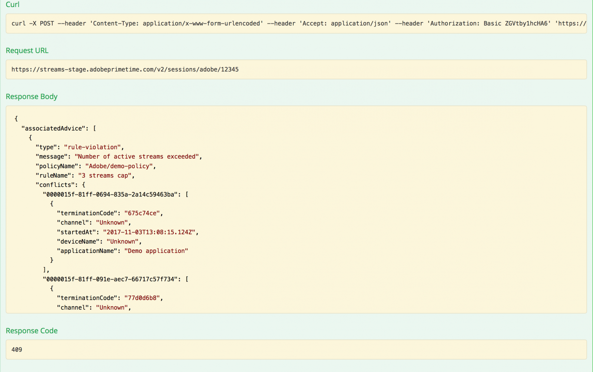

# API-översikt {#api-overview}

Visa [API-dokumentation online](http://docs.adobeptime.io/cm-api-v2/) för mer information.

## Syfte och krav {#purpose-prerequisites}

Det här dokumentet hjälper programutvecklare att använda specifikationen för Swagger API när de implementerar en integrering med Concurrency Monitoring. Vi rekommenderar starkt att läsaren har en tidigare förståelse för de begrepp som definieras av tjänsten innan han/hon följer denna riktlinje. För att få denna förståelse är det nödvändigt att ha en översikt över [produktdokumentation](/help/concurrency-monitoring/cm-home.md) och [Swagger API-specifikation](http://docs.adobeptime.io/cm-api-v2/).

## Introduktion {#api-overview-intro}

Under utvecklingsprocessen utgör den offentliga dokumentationen för Swagger referensriktlinjerna för att förstå och testa API-flödena. Det här är en bra startpunkt för att ha en praktisk strategi och bekanta dig med hur verkliga program fungerar i olika scenarier för användarinteraktion.

Skicka in en biljett [Zendesk](mailto:tve-support@adobe.com) för att registrera ditt företag och program i Concurrency Monitoring. Adobe tilldelar ett program-ID till varje enhet. I den här guiden kommer vi att använda två referensprogram med ID **demo-app** och **demo-app-2** som kommer att vara under hyresgästen Adobe.

## Användningsexempel {#api-use-case}

Det första steget i att testa ett flöde med Swagger är att ange program-ID:t i sidans övre högra hörn så här:

Efter detta trycker vi **Utforska** för att ange det ID som ska användas i auktoriseringshuvudet för alla anrop till REST API.  Alla API-anrop förväntar sig att program-ID:t skickas via grundläggande HTTP-autentisering. Användarnamnet är program-ID:t och lösenordet är tomt.

### Första programmet {#first-app-use-cases}

Program med ID **demo-app** har av Adobe team tilldelats en policy med en regel som begränsar antalet samtidiga strömmar till 3. En profil tilldelas till ett specifikt program baserat på den begäran som skickas in i Zendesk.

#### Hämtar metadata {#retrieve-metadata-use-case}

Det första anropet vi gör är att Metadata-resursen ska hämta listan över metadataattribut som behövs för att skickas som formulärdata under sessionsinitieringen. Dessa metadata kommer att användas för att utvärdera de principer som tilldelats för det här programmet.

När du har tryckt på Testa det för programmet med ID **demo-app** får vi följande resultat:

Listan med metadataattribut är tom, vilket vi kan se i svarsfältet. Det innebär att de attribut som krävs för design är tillräckliga för att utvärdera den 3-strömningsprincip som tilldelats det här programmet. Se även [Dokumentation för standardmetadatafält](/help/concurrency-monitoring/standard-metadata-attributes.md). Efter det här samtalet kan vi fortsätta och skapa en ny session för REST-resursen för sessioner.

#### Initiering av session {#session-initial}

Initieringsanropet för sessionen utförs av ett program efter att all nödvändig information som krävs för att det ska kunna utföras har hämtats.

Ingen avslutningskod behöver anges för det första samtalet eftersom vi inte har några andra aktiva strömmar. Och inget metadataattribut eftersom inget returnerades från anropet Hämta metadata.

The **ämne** och **idp** parametrar är obligatoriska, de specificeras som URI-sökvägsvariabler. Du kan få **ämne** och **idp** parametrar genom att anropa **mvpd** och **upstreamUserID** metadatafält från Adobe Primetime-autentisering. Se även [översikt över metadata-API:er](https://experienceleague.adobe.com/docs/primetime/authentication/auth-features/user-metadat/user-metadata-feature.html?lang=en#). I det här exemplet anger vi värdet&quot;12345&quot; som ämne och&quot;adobe&quot; som idp.

Anropa sessionsinitieringen. Du får följande svar:

Alla data vi behöver finns i svarsrubrikerna. The **Plats** sidhuvudet representerar ID:t för den nya skapade sessionen och **Datum** och **Upphör** huvuden representerar de värden som används för att schemalägga programmet så att nästa pulsslag kan hållas igång.

#### Hjärtslag {#heartbeat}

Ring ett hjärtslag. Ange **sessions-ID** hämtas i sessionens initieringsanrop, tillsammans med **ämne** och **idp** parametrar används.

Om sessionen fortfarande är giltig (den har inte gått ut eller tagits bort manuellt) får du ett resultat:

Som i det första fallet ska vi använda **Datum** och **Upphör** rubriker om du vill schemalägga ett annat pulsslag för den här sessionen. Om sessionen inte längre är giltig misslyckas anropet med en 410 GONE HTTP-statuskod.

Du kan använda alternativet &quot;Håll strömmen vid liv&quot; som är tillgängligt i användargränssnittet för Swagger för att köra automatiska pulsslag på en viss session. Det kan hjälpa dig att testa en regel utan att behöva bekymra dig om den standardplåt som behövs för att göra sessionshjärtslag i rätt tid. Den här knappen placeras bredvid knappen&quot;Prova ut&quot; på fliken Svag pulsslag. Om du vill ställa in en automatisk pulsslag för alla sessioner som skapas måste du ha dem schemalagda var och en i ett separat Swagger-gränssnitt som öppnas på en webbläsarflik.

#### Sessionsavslut {#session-termination}

Företagets affärsplan kan kräva Concurrency Monitoring för att avsluta en viss session, t.ex. när en användare slutar titta på en video. Detta kan du göra genom att ringa ett DELETE-anrop till Sessions-resursen.

Använd samma parametrar för anropet som för sessionens pulsslag. HTTP-svarskoderna är:

* 202 ACCEPTERAT för ett lyckat svar
* 410 GONE om sessionen redan hade stoppats.

#### Bryter principen {#breaking-policy-app-first}

För att simulera beteendet hos programmet när den 3-strömningspolicy som är tilldelad till den bryts, måste vi göra tre anrop för sessionsinitiering. För att principen ska börja gälla måste anropen göras innan en session förfaller på grund av brist på hjärtslag. Vi kommer att se att alla dessa samtal lyckas, men om vi gör en fjärde misslyckas de med följande fel:

Vi får ett 409 CONFLICT-svar tillsammans med ett utvärderingsresultatobjekt i nyttolasten. Läs en fullständig beskrivning av utvärderingsresultatet i [Swagger API-specifikation](http://docs.adobeptime.io/cm-api-v2/#evaluation-result).

Programmet kan använda informationen från utvärderingsresultatet för att visa ett visst meddelande för användaren när videon stoppas och vidta ytterligare åtgärder om det behövs. Ett exempel kan vara att stoppa andra befintliga strömmar för att starta en ny. Detta görs genom att använda **terminateCode** värdet finns i **konflikter** -fält för ett specifikt attribut som står i konflikt. Värdet anges som X-Terminate HTTP-huvud i anropet till en ny sessionsinitiering.

När du anger en eller flera avslutningskoder vid sessionsinitieringen lyckas anropet och en ny session genereras. Om vi sedan försöker skapa ett pulsslag med en av sessionerna som har fjärrstoppats får vi tillbaka ett 410 GONE-svar med en nyttolast som beskriver att sessionen har fjärravslutats, som i exemplet:

### Andra programmet {#second-application}

Det andra exempelprogrammet som vi kommer att använda är det som har ID **demo-app-2**. Den här har tilldelats en princip med en regel som begränsar antalet tillgängliga strömmar för en kanal till maximalt 2.   Du måste ange kanalvariabeln för att kunna utvärdera den här principen.

#### Hämtar metadata {#retrieving-metadata}

Ange det nya program-ID:t i det övre högra hörnet på sidan och anropa metadataresursen. Du får följande svar:

Den här gången är svarstexten inte längre en tom lista, som i exemplet med det första programmet. Nu anger Concurrency Monitoring Service i svarstexten att **kanal** metadata krävs vid sessionsinitieringen för att utvärdera principen.

Om du ringer ett samtal utan att ange ett värde för **kanal** -parametern får du:

* Svarskod - 400 FELAKTIG BEGÄRAN
* Svarstext - en nyttolast för utvärderingsresultat som beskrivs i **skyldigheter** fält vad som förväntas i begäran om sessionsinitiering för att åtgärden ska lyckas.

#### Initiering av session {#session-init}

Tilldela ett värde för den metadatanyckel som krävs och ange det som en formulärparameter i sessionsinitieringsbegäran, vilket visas nedan:

Nu kommer samtalet att lyckas och en ny session kommer att skapas.

#### Bryter principen {#breaking-policy-second-app}

För att bryta regeln som vi har i den policy som tilldelats det här programmet måste vi ringa 2 samtal med samma kanalvärde. Precis som i det första exemplet måste det andra anropet göras medan den första sessionen som skapas fortfarande är giltig.

Om vi använder olika värden för kanalmetadata varje gång vi skapar en ny session lyckas alla anrop eftersom tröskelvärdet 2 omfattar varje värde för sig.

Som i det första exemplet kan vi använda avslutningskoden för att fjärrstoppa strömmar som är i konflikt eller vänta på att en av strömmarna ska förfalla, förutsatt att ingen pulsslag kommer att användas på dem.

