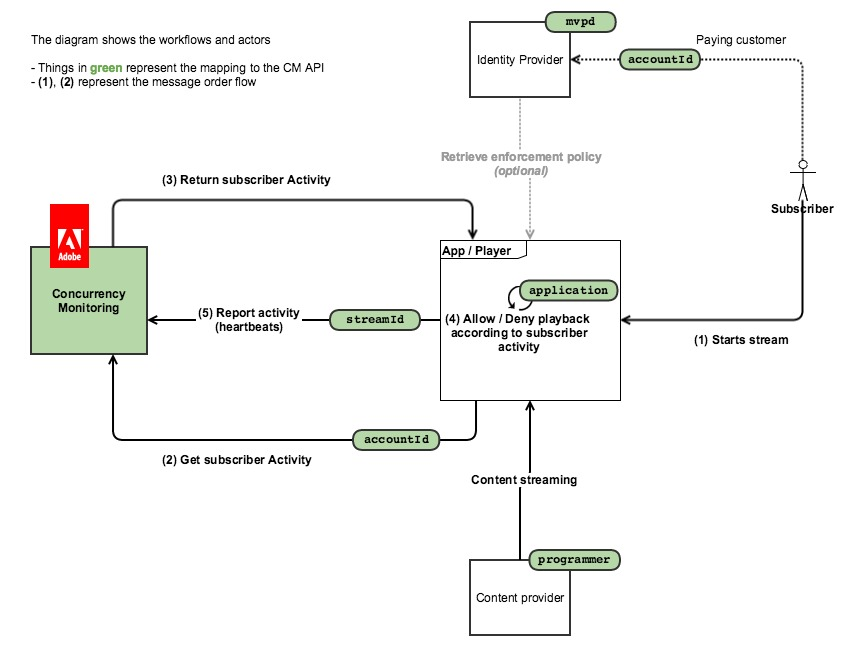

# Policyinformationspunkt {#pip}

>[!NOTE]
>
>Den här sidan är inaktuell eftersom den gäller den tidigare versionen av API som inte längre rekommenderas för nya integreringar

I följande diagram visas flödet om kunden väljer **Policyinformationspunkt**, i vilket fall CM bara används för att fråga aktiviteten och all åtkomstlogik är inbäddad i klientprogrammet):

Bilden nedan visar hur ströminventering fungerar för en användare som tittar på innehåll från två enheter.

I korthet är det vanliga meddelandeflödet följande:

1. För en användare som aldrig har använt tjänsten läses en webbsida in/ett program öppnas, där ett program med Concurrency Monitoring Service gör ett sessionsinitieringsanrop.
1. Övervakningstjänsten för samtidig användning returnerar den nya strömresursen för hjärtslag samt den aktuella användaraktiviteten.
1. Under videouppspelning gör det instrumenterade programmet hjärtslagsanrop till Concurrency Monitoring Service, vilket visar att användaren för närvarande använder en video.
1. Andra instrumenterade program kan göra statusfrågeanrop till Concurrency Monitoring Service, som returnerar den aktuella användaraktiviteten.
1. När videouppspelningen avslutas kan det instrumenterade programmet göra ett pulsslagsanrop med &quot;event=stop&quot;, vilket anger att videon har stoppats och att den aktuella strömmen inte längre ska räknas som en aktiv ström.

