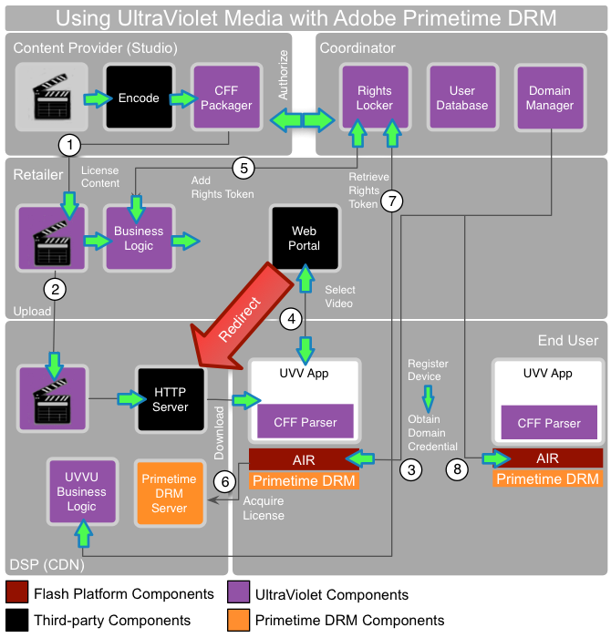

# UltraViolet media och Adobe Primetime DRM {#ultraviolet-media-and-adobe-primetime-drm}

Adobe Primetime DRM kan användas tillsammans med andra tredjepartslösningar för innehållsströmning för att skapa ett komplett och säkert DRM-baserat mediedistributionssystem.

UltraViolet är ett system för autentisering av digitala rättigheter och molnbaserad distribution som gör det möjligt för konsumenter av digitalt hemunderhållningsinnehåll att strömma och ladda ned köpt innehåll via flera plattformar och enheter. UltraViolet-innehåll laddas ned (eller direktuppspelas) i ett Common File Format (CFF) med Common Encryption (CENC).

Det är enkelt att skapa ett UltraViolet-system tillsammans med Adobe Primetime DRM. I följande exempel visas hur innehållsflödet fungerar:

<!---->

1. Innehållsägaren kodar och paketerar innehållet i CFF. Det paketerade innehållet är licensierat till en återförsäljare för distribution.
1. Återförsäljaren överför innehållet till en digital tjänsteleverantör, som CDN. Innehållet är nu tillgängligt för hämtning. Vissa av dessa roller kan spelas upp av ett eller flera företag.

   Slutanvändaren har en enhet som stöder Adobe AIR. Dessutom måste användaren installera ett UltraViolet-kompatibelt program. Programmet innehåller den kod som krävs för att tolka CFF-filen och presentera den för körningsmiljön. Alla känsliga kryptografiska åtgärder hanteras i den säkra miljön.
1. Programmet kan utlösa en domänanslutning för enheten, vilket interagerar med koordinatorn. Koordinatorn underhåller ett rättighetsarkiv, en användardatabas och domäner. Koordinatorns domänhanterare byggs med hjälp av Primetimes DRM SDK för att implementera DRM-specifika domänanslutningar/domänledighetsåtgärder.
1. Användaren kan sedan använda programmet för att välja en video som han eller hon vill hämta från återförsäljaren. Detaljhandlaren tillhandahåller vanligtvis en webbportal och hanterar all affärslogik.
1. Återförsäljaren interagerar sedan med koordinatorn för att lägga till en rättighetstoken. Återförsäljaren dirigerar sedan om begäran till tjänsteleverantören för den faktiska nedladdningen av innehåll.
1. Om enheten ännu inte har någon licens för innehållet utlöses en licensbegäran med CFF. Begäran innehåller vanligtvis ett domäncertifikat, inloggningsuppgifter och information om programmet. Tjänsteleverantören använder en Primetime DRM-licensserver (som utvecklats med Primetimes DRM SDK) som följer UltraViolet-specifikationerna.
1. Tjänsteleverantörens UltraViolet-affärslogik interagerar med koordinatorn efter behov för att hämta rätt behörighetstoken för att avgöra om en innehållslicens ska utfärdas.

   Innehållslicensen är bunden till domänen. Klientprogrammet kan infoga licensen i CFF-filen. Innehåll kan nu spelas upp i programmet, med alla skydd- och användningsregelkontroller som hanteras av DRM-komponenten Primetime i körningsmiljön.
1. Andra enheter och program som ägs av samma slutanvändare kan registreras hos koordinatorn. Innehållet kan nu läsas in i andra Primetime DRM-enheter utan att någon extern transaktion krävs.
