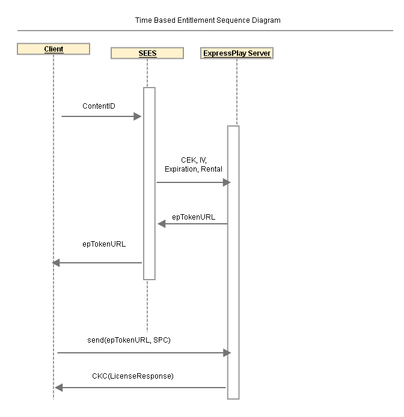

# Referenstjänst: Tidsbaserat berättigande {#reference-service-time-based-entitlement}

Arbeta med SEES för att se hur du aktiverar en tidsbaserad tillståndsservice med ExpressPlay.

SEES tar emot en begäran om tillstånd (se avsnittet Offentligt API) från klienten. SEES-servern söker upp CEK och IV baserat på `contentID`, lägger till `expirationTime`och vidarebefordrar begäran till ExpressPlay-servern. Den sista ExpressPlay-token är tidsbunden. Se sekvensdiagrammet Tidsbaserad behörighet nedan. 

**Tabell 1: Licensparametrar skickade av klienten**

| Frågeparameter | Beskrivning | Obligatoriskt |
|---|---|---|
| `contentKey` | En 16 byte hexadecimal strängbeteckning för innehållskrypteringsnyckeln | Ja |
| `iv` | En 16 byte hexadecimal strängbeteckning för innehållskryptering IV | Ja |
| `rentalDuration` | Hyrningens varaktighet i sekunder (standard = 0) | Nej |

**Tabell 2: Tokenbegränsningsparametrar som lagts till av SEES-servern**

<table id="table_E979FAD7A61A4832A46667301939FAEB">  
 <thead> 
  <tr> 
   <th class="entry"> Frågeparameter </th> 
   <th class="entry"> Beskrivning </th> 
   <th class="entry"> Obligatoriskt? </th> 
  </tr> 
 </thead>
 <tbody> 
  <tr> 
   <td> expirationTime </td> 
   <td>Förfallotid för denna token. Det här värdet måste vara en sträng i <a href="https://www.ietf.org/rfc/rfc3339.txt" format="html" type="external"> RFC 339</a> -format för datum/tid i Z-zondesignern ("Zulu time") eller ett heltal föregånget av ett plustecken (+). Ett exempel på ett RFC 3339-datum/tid är  2006-04-14T12:01:10Z. 
Om värdet är en sträng i RFC 339-format för datum/tid representerar det ett absolut förfallodatum/tid för token. Om värdet är ett heltal föregånget av ett plustecken tolkas det som ett relativt antal sekunder från utfärdandet att token är giltig. Exempel:  +60 anger en minut. Den maximala (och standardvärdet, om inget anges) tokenlivstiden är 30 dagar. Använd det kodade formuläret %2B när du anger plustecknet (+). 
 </td> 
   <td> Nej </td> 
  </tr> 
 </tbody> 
</table>

