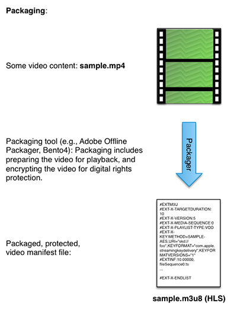

# Arbetsflöde med flera DRM-DRM för FairPlay {#multi-drm-workflow-for-fairplay}

DRM-arbetsflödena innefattar att paketera ditt innehåll, tillhandahålla licensiering för innehållet och spela upp det skyddade innehållet från ditt eget videoprogram. Arbetsflödet liknar vanligtvis för varje DRM-lösning, men med vissa skillnader finns i informationen.

Det här Multi-DRM-arbetsflödet tar dig igenom konfiguration, paketering, licensiering och uppspelning av HLS-innehåll som skyddas med Apple FairPlay. Det här arbetsflödet innehåller även valfria instruktioner för att implementera uppspelning offline och licensrotation.

## Aktivera ExpressPlay-tjänsten för FairPlay {#enable-expressplay-service-for-fairplay}

FairPlay DRM-lösningen från Apple kräver lite konfiguration när du använder den med ExpressPlay DRM-tjänsterna. Detta innebär att du måste hämta inloggningsuppgifter från Apple och överföra dem till ExpressPlay.

Följ de här stegen för att aktivera ExpressPlay-tjänsten för att skydda FairPlay-innehåll.

1. Hämta inloggningsuppgifter från Apple.

   Dessa autentiseringsuppgifter tilldelas unikt till varje tjänsteleverantör. Du måste beställa dem genom att fylla i följande formulär: [https://developer.apple.com/contact/fps/](https://developer.apple.com/contact/fps/).

   >[!NOTE]
   >
   >Välj **[!UICONTROL Content Provider]** Primär roll.

   När din begäran har godkänts skickar Apple ett distributionspaket *för* FairPlay-direktuppspelning.
1. Skapa en CSR-fil (Certificate Signing Request).

   Du kan använda för [!DNL openssl] att generera ditt nyckelpar för offentlig/privat nyckel och din CSR-signerade certifikatbegäran.

   1. Generera nyckelpar.

      ```
      openssl genrsa -aes256 -out privatekey.pem 1024 
      ```

   1. Generera CSR.

      ```
      openssl req -new -sha1 -key privatekey.pem -out certreq.csr  
        -subj "/CN=SubjectName /OU=OrganizationalUnit /O=Organization /C=US"
      ```

      >[!NOTE]
      >
      >Instruktionerna för det här steget finns i ditt distributionspaket *för* FairPlay-direktuppspelning, men finns här för att underlätta. Om du har problem med den här delen av processen kan du läsa instruktionerna i *FairPlayCertificateCreation.pdf* (i ditt distributionspaket).

1. Överför din CSR via Apples utvecklarportal.
   1. Utvecklingsteamets Team Agent måste logga in [!DNL developer.apple.com/account].
   1. Klicka på **[!UICONTROL Certificates, Identifiers & Profiles]** och välj sedan den **[!UICONTROL iOS, tvOS, watchOS]** nedrullningsbara listan längst upp till vänster på sidan. Klicka sedan på **[!UICONTROL Certificates->Production]** till vänster på sidan.
   1. Klicka på **[!UICONTROL +]** knappen uppe till höger på sidan för att begära ett nytt certifikat. Välj alternativet **[!UICONTROL FairPlay Streaming Certificate]** under **[!UICONTROL Production]**.

      Dialogrutan *Lägg till iOS-certifikat* öppnas.
   1. I *Lägg till iOS-certifikat*&#x200B;överför du CSR-filen som du skapade i steg 2.b. och klickar på **[!UICONTROL Generate]**.

      Din programhemlighetsnyckel (ASK) visas i samma dialogruta.
   1. Skriv ned ASK och lagra den på en säker plats.
   1. Nyckel i ASK för att slutföra certifikatgenereringen och klicka på **[!UICONTROL Continue]**.
   1. När du har verifierat att du har sparat ASK klickar du på **[!UICONTROL Generate]** för att fortsätta.

      >[!NOTE]
      >
      >Det är viktigt att du sparar en kopia av ASK och lagrar den på ett säkert sätt. *Om din ASK är komprometterad kan du inte längre skydda ditt innehåll med FairPlay Streaming.* Endast en (1) ASK tilldelas ditt team. Värdet kommer inte att anges igen och du kan inte hämta det senare.

   1. Hämta ditt FPS-certifikat.

      Spara en säkerhetskopia av din privata nyckel (från steg 2.a) och din offentliga nyckel (det FPS-certifikat du laddade ned i det här steget) på en säker plats.
1. Konfigurera ditt ExpressPlay-konto med dina FairPlay-inloggningsuppgifter.
   1. Säg namnet på certifikatet som du laddade ned i steg 3.h. är [!DNL fairplay.cer].
   1. Öppna [!DNL fairplay.cer] filen med Apple Keychain Access-verktyget.
   1. Filtrera dina många certifikat genom att ange &quot; `fairplay`&quot; i sökfältet som finns uppe till höger.
   1. Identifiera företagets FairPlay-certifikat.

      Ditt företagsnamn ska kopplas till det certifikat som utfärdas av Apple.
   1. Expandera certifikatet genom att markera pilen Expandera och högerklicka på din privata nyckel.
   1. Markera **[!UICONTROL Export "Your Company Name"]** och spara [!DNL .p12] filen.

      Du ombeds att ange ett lösenord för att skydda den här filen. Anteckna det här lösenordet eftersom du måste skicka det tillsammans med ditt autentiseringspaket.
   1. Logga in på ditt konto på [www.expressplay.com](https://www.expressplay.com).
   1. Klicka **[!UICONTROL DRM SERVICES]** i det övre vänstra hörnet och välj sedan **[!UICONTROL FairPlay]** fliken.
   1. Överför dina FairPlay-inloggningsuppgifter till ditt ExpressPlay-konto.

      1. Skapa en textfil som innehåller ASK-värdet (det ska vara 32 tecken, till exempel: `1234567890abcdef1234567890abcdef`) och välj den här filen för överföring.
      1. Välj PKCS12-filen i steg 4.f. för överföring.
      1. Ange lösenordet för PKCS12-filen från steg 4.f.
      1. Klicka på knappen Överför.

Nu kan du skapa iOS-program eller HTML5-sidor med FairPlay-innehållsskydd tillsammans med ditt [!DNL fairplay.cer] certifikat med ExpressPlay-tjänsten för FairPlay.

<!--<a id="fig_sjr_2pn_sv"></a>-->


### Paketera ditt innehåll för FairPlay {#package-your-content-for-fairplay}

Om du vill paketera innehåll kan du antingen använda offlinepaketeraren i Adobe eller andra verktyg som ExpressPlay Bento4-paketeraren.

Paket förbereder videon för uppspelning (t.ex. fragmentering av originalfilen och publicering) och skyddar videon med den valda DRM-lösningen (i det här fallet FairPlay):

* [Adobe Offline Packager for FairPlay DRM](https://helpx.adobe.com/content/dam/help/en/primetime/guides/offline_packager_getting_started.pdf#page=21)
* [ExpressPlay-paket - Bento4 för HLS](https://www.bento4.com/developers/hls/)

<!--<a id="fig_jbn_fw5_xw"></a>-->



1. Paketera innehållet.

   Här är ett exempel på paketering med Adobe Offline Packager. I Packager används en konfigurationsfil (t.ex. [!DNL fairplay.xml]) som ser ut ungefär så här:

   ```
   <config>
   <in_path>mp4_file_path</in_path>
   <out_type>hls</out_type>
   <out_path>out_file_path</out_path>
   <drm/>
   <drm_sys>FAIRPLAY</drm_sys>
   <frag_dur>4</frag_dur>
   <target_dur>6</target_dur>
   <key_file_path>creds/fairplay.bin</key_file_path>
   <iv_file_path>creds/iv.bin</iv_file_path>
   <key_url>user_provided_value</key_url>
   <content_id>_default_</content_id>
   </config>
   ```

   * `in_path` - Den här posten pekar på var källvideon finns på den lokala paketeringsdatorn.
   * `out_type` - Den här posten beskriver typen av paketerade utdata, i det här fallet HLS för FairPlay.
   * `out_path` - Den plats på den lokala datorn där du vill att dina utdata ska hamna.
   * `drm_sys` - Den DRM-lösning du packar för. Detta är `FAIRPLAY` i det här fallet.
   * `frag_dur` - Fragmentets varaktighet i sekunder.
   * `target_dur` - Mållängden för HLS-utdata.
   * `key_file_path` - Det här är den plats där licensfilen finns på paketeringsdatorn som fungerar som CK (Content Encryption Key). Det är en Base-64-kodad 16-byte hex-sträng.
   * `iv_file_path` - Det här är platsen för IV-filen på paketeringsdatorn.
   * `key_url` - URI-parametern för `EXT-X-KEY` -taggen i [!DNL .m3u8] filen.
   * `content_id` - Standardvärde.

   Som anges i [Packager-dokumentationen](https://helpx.adobe.com/content/dam/help/en/primetime/guides/offline_packager_getting_started.pdf#page=7)skapar du en konfigurationsfil som innehåller de vanliga alternativen som du vill använda för att generera utdata. Skapa sedan utdata genom att ange specifika alternativ som kommandoradsargument.&quot;

   ```
   java -jar OfflinePackager.jar -in_path sample.mp4 -out_type hls 
   -out_path out_file_path -drm -drm_sys FAIRPLAY -key_file_path "creds/fairplay.bin" 
   -key_url "user_provided_value"
   ```

   Den genererade M3U8-filen har ett `EXT-X-KEY` attribut som ser ut så här:

   ```
   #EXT-X-KEY:METHOD=SAMPLE-AES,URI="user_provided_value",​
   KEYFORMAT="com.apple.streamingkeydelivery",KEYFORMATVERSIONS="1" 
   ```

### Ange principer för FairPlay {#setting-policies-for-fairplay}

Du kan ange principer för FairPlay-skyddat innehåll med hjälp av en tillståndsserver. Du kan konfigurera en egen eller använda en exempeltillståndsserver som tillhandahålls av Adobe.

Adobe tillhandahåller en SEES-server (Sample ExpressPlay Entitlement Server) som visar hur du gör *tidsbaserade* och *enhetsbindande* tillstånd. Denna exempeltillståndsserver är byggd på ExpressPlay-tjänster.

[Referensserver: Exempel på ExpressPlay-tillståndsserver (SEES)](../../multi-drm-workflows/feature-topics/sees-reference-server.md)

* [Referenstjänst: Tidsbaserat berättigande](../../multi-drm-workflows/feature-topics/sees-reference-server-time-entitlement.md)
* [Referenstjänst: Enhetsbindningsberättigande](../../multi-drm-workflows/feature-topics/sees-reference-server-binding-entitlement.md)

## Licensiering och uppspelning för FairPlay {#licensing-and-playback-for-fairplay}

Licensiering och uppspelning av FairPlay-skyddat innehåll kräver byte av URL-scheman, mellan schemat som används i videomanifestfilen (skd:) och det som används i ExpressPlay-tokenbegäranden (https:).

Anvisningar för hur du implementerar licensiering och uppspelning från en iOS TVSDK-klient finns här: [Aktivera Apple FairPlay i TVSDK-program](../../../programming/tvsdk-3x-ios-prog/ios-3x-drm-content-security/ios-3x-apple-fairplay-tvsdk.md). Du kan också implementera uppspelning offline och licensrotation för FairPlay.

## HLS offline med FairPlay {#section_047A05D1E3B64883858BC601CFC8F759}

Du kanske vill göra det möjligt för användare att spela upp FairPlay-skyddat innehåll när licensieringen inte kan hämtas eftersom spelaren är isolerad från webben (till exempel på ett flygplan).

Innan du påbörjar den här uppgiften ska du ladda ned och läsa Apples dokument **&quot;Offline Playback with FairPlay Streaming and HTTP Live Streaming&quot;**. Läs guiden och lär dig hur du hämtar TS-segment (Transport Stream) och sparar dem på din lokala dator.

Implementera offlineuppspelning för FairPlay med det här arbetsflödet:

1. Ladda ned segmentet HLS TS.
1. Begär en Persistent Hyror-licens från FairPlay-servern (se **&quot;FairPlay Persistent Uental Policy&quot;**).
1. Spara `persistentContentKey`.
1. Spela upp FairPlay-innehållet offline.

>[!NOTE]
>
>FairPlay-direktuppspelning på klienten startar inte dekrypteringen om den beständiga innehållsnyckeln har upphört att gälla. Användaren fortsätter dock att uppleva om innehållsnyckeln upphör under uppspelningen.
>
>Mer information finns i [Arbeta med HTTP-direktuppspelningsdokument](https://developer.apple.com/library/content/documentation/AudioVideo/Conceptual/MediaPlaybackGuide/Contents/Resources/en.lproj/HTTPLiveStreaming/HTTPLiveStreaming.html#//apple_ref/doc/uid/TP40016757-CH11-SW3) .

### FairPlay-licensrotation {#section_D32AA08C61474B4F876AC2A5F18CB879}

Licensrotation är ett sätt att förhindra att innehåll spelas upp under lång tid och kan hackas i licensen.

I ett M3U8-manifest kommer varje nyckeltagg att gälla för följande TS-segment fram till nästa nyckeltagg, eller till slutet av filen.

Så här lägger du till licensrotation:

* Infoga en ny FairPlay-nyckeltagg under licensrotationstiden.

   Du kan lägga till valfritt antal nyckeltaggar.

   För linjärt innehåll måste du se till att behålla den senaste nyckeltaggen i M3U8-fönstret. iOS begär nästa M3U8 när det finns ungefär två TS-segment kvar att spela upp (ca 20 sekunder). Om nya M3U8 innehåller nya nyckeltaggar kommer alla nyckelförfrågningar att ske omedelbart. De tidigare befintliga nycklarna kommer inte att begäras igen. iOS väntar på att alla nyckelbegäranden ska slutföras innan uppspelningen startar.

   För VOD-innehåll med licensrotation sker alla nyckelbegäranden i början av uppspelningen.

   Här följer ett exempel på M3U8 med tangentrotation:

   ```
   #EXTM3U
   #EXT-X-TARGETDURATION:10
   #EXT-X-VERSION:5
   #EXT-X-MEDIA-SEQUENCE:0
   #EXT-X-PLAYLIST-TYPE:VOD
   #EXT-X-KEY:METHOD=SAMPLE-AES,URI="skd://one?cek=1dc2cc71d913f4f74eca0c4632
   212b25&iv=e21f0f72b6363ff6143737cb1e9ca8d7",KEYFORMAT="com.apple.streaming
   keydelivery",KEYFORMATVERSIONS="1"
   #EXTINF:10,
   fileSequence0.ts
   #EXTINF:10,
   fileSequence1.ts
   #EXTINF:10,
   fileSequence2.ts
   #EXTINF:10,
   fileSequence3.ts
   #EXTINF:10,
   fileSequence4.ts
   #EXTINF:10,
   fileSequence5.ts
   #EXTINF:10,
   fileSequence6.ts
   #EXTINF:10,
   fileSequence7.ts
   #EXTINF:10,
   #EXT-X-KEY:METHOD=SAMPLE-AES,URI="skd://two?cek=f6efc698b96cf8f4fa46d5237d
   337c77&iv=18401077091784bcda8079acf978dc95",KEYFORMAT="com.apple.streaming
   keydelivery",KEYFORMATVERSIONS="1"
   #EXTINF:10,
   fileSequence8.ts
   #EXTINF:10,
   ```
