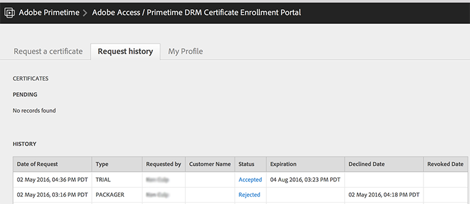

# Skaffa licenser (konton, etc.) {#get-provisioned-accounts-etc}

För att komma igång med Primetime DRM Cloud, som drivs av ExpressPlay, måste du konfigurera Adobe Cert- och ExpressPlay-konton med din Adobe-representant.

1. Kontakta din Adobe-representant och begär de Adobe Cert- och ExpressPlay-konton du behöver för att implementera Multi-DRM med TVSDK.

   Ange den e-postadress som du vill använda som kontaktpunkt för din Adobe-representant. Adobe skapar sedan två konton åt dig:

   * ***Certifikatportalkonto*** - ( https://certportal.primetime.adobe.com) : *Adobe Access/Primetime DRM Certificate Enrollment Management Team* skickar ett e-postmeddelande till de adresser du har angett. E-postmeddelandet innehåller URL:en för Adobe cert-portalen, tillsammans med en länk till dokumentationen för registrering av Adobe-certifikat (de senaste dokumenten finns här: [Handbok för registrering av certifikat](../../../digital-rights-management/certificate-enrollment-guide/about-certs.md)).

   * ***ExpressPlay-konto*** - Adobe skickar ett e-postmeddelande till dig som innehåller en länk som du använder för att registrera ditt ExpressPlay Admin-konto.

1. Logga in på Adobe certifikatportal med din Adobe ID (använd samma e-postadress som du angav för Adobe). Om du inte har någon Adobe ID ännu kan du snabbt skapa en genom att följa följande *Skaffa en Adobe ID* länk från certifikatportalen:

   <!---->

   

1. På Adobe cert-portalen kan du begära en *testversion* cert.

   För Multi-DRM-testversionen kommer ett testcertifikat att omfatta alla dessa aspekter av innehållsskydd: paketering, licensiering och transport. Du måste själv ange [CSR](../../../digital-rights-management/certificate-enrollment-guide/request-certs/gen-cert-signing-req.md) för att göra en förfrågan om certifikat:
   <!---->

   

   Adobe kommer att skicka ett e-postmeddelande till dig som anger att du godkänner eller avvisar din certifikatbegäran. Du kan se status för dina certifikatbegäranden på *Begäranhistorik* på certifikatportalen:
   <!---->

   

1. Skapa ett ExpressPlay-administratörskonto.

   Följ länken till ExpressPlay som Adobe har gett dig. Då öppnas *Skapa ett konto* på ExpressPlay. Fyll i de uppgifter som krävs och skicka in formuläret. Du får ett e-postmeddelande från `operations@expressplay.com` som innehåller en aktiveringslänk som är bra i en vecka. Konfigurera ExpressPlay-tjänsten när du har aktiverat:
   <!---->

   

   När du har skapat tjänsten visas din egen Admin-sida. Tillsammans med vissa aktivitetsspårningsfält visas din produktion och testning *kundautentiserare* (API-nycklar) och URL:er för produktions- och testtjänster:

   <!---->

    

1. Om du använder FairPlay krävs ytterligare steg (på Apple utvecklarwebbplats) för att komma igång med ExpressPlay. Se [Aktivera ExpressPlay-tjänsten för FairPlay](../../multi-drm-workflows/p-l-and-p/fairplay-workflow.md#enable-expressplay-service-for-fairplay) för instruktioner.
