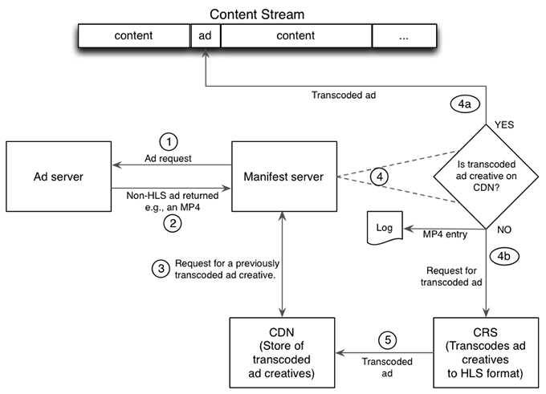

# Detaljerade arbetsflöden för JIT-ompaketering {#detailed-workflows-for-jit-repackaging}

Antingen en klientvideospelare eller manifestserver kan interagera med CRS för att uppnå JIT-ompaketering. Båda använder samma logik för annonsval.

## JIT-ompaketering initierad av manifestservern {#section_1F1C1B7DD146403890C2B43E24FEF0EB}

Arbetsflödet för JIT-ompaketering på manifestserversidan är följande:

1. Manifestservern skickar en begäran till annonsservern.
1. Manifestservern tar emot en annonskreativ som inte är i HLS-format.
1. Manifestservern skickar en begäran till CDN-servern om en tidigare omkodad HLS-version av annonskreativiteten.

   >[!NOTE]
   >
   >I en multi-CDN-konfiguration använder manifestservern parametern `ptcdn` i bootstrap-URL:en för att identifiera CDN-servern.

1. Manifestservern kontrollerar svaret:

   1. Om begäran lyckas infogar manifestservern den tidigare omkodade HLS-versionen av annonsen som är kreativ i innehållsströmmen.
   1. Om begäran misslyckas genererar manifestservern en loggpost och begär en omkodad version från CRS.

1. CRS omkodar annonsens kreativitet och överför HLS-versionen till CDN-servern för framtida bruk.

För alla efterföljande förfrågningar för den kreativa delen hämtar manifestservern HLS-versionen från CDN och infogar den i innehållsströmmen.

## JIT-ompaketering initierad av klienten {#section_FBC97D40043F4FDD98247A08BB6195B0}

<!---->

En klient baserad på TVSDK eller med liknande funktioner kan interagera med CRS för att få JIT-ompaketering enligt följande:

1. Klienten begär en annons från annonsservern.
1. Annonsservern returnerar annonsen till klienten.
1. Klienten kontrollerar annonsens format från annonsservern:

   1. Om annonsautomatisering är i HLS-format infogar (häftar ihop) klienten den i innehållet och är klar.
   1. Om annonsautomatisering inte är i HLS-format begär klienten en från CDN-servern.

      >[!NOTE]
      >
      >I en multi-CDN-konfiguration använder manifestservern parametern `ptcdn` i bootstrap-URL:en för att identifiera CDN-servern.

1. Klienten kontrollerar svaret från CDN-servern.

   1. Om CDN tillhandahöll en HLS-version infogar (häftar ihop) klienten den i innehållet och är klar.
   1. Om CDN-servern inte har någon HLS-version ber klienten annonsservern att begära en från CRS. Klienten infogar inte annonsen i innehållet.

1. Annonsservern begär att icke-HLS ska kodas om till HLS.
1. CRS skapar en HLS-version och överför den till CDN-servern för framtida bruk.

## Prioriteter och tidslinje för annonseringsformat {#section_A74DE37A57BF45D7B6D09E3DE40F8E61}

Manifestservern och klienten använder samma urvalslogik för att fastställa prioriteter för uppspelning av tillgängliga annonser. HLS-formaterade annonser har högsta prioritet, följt av MP4, FLV och slutligen WebM.

CRS tar vanligtvis 2-4 minuter att bearbeta en icke-HLS-annons, och vanligtvis mindre än 3 minuter.

CRS skapar olika HLS-bithastigheter, så annonsen kan spelas upp med en hastighet som passar den tillgängliga anslutningshastigheten och bandbredden. Om det finns flera tillgängliga bithastigheter väljer CRS den högsta tillgängliga bithastigheten. Om CRS tar emot en icke-HLS-annons skapar den en HLS-version med den högsta möjliga upplösningen.